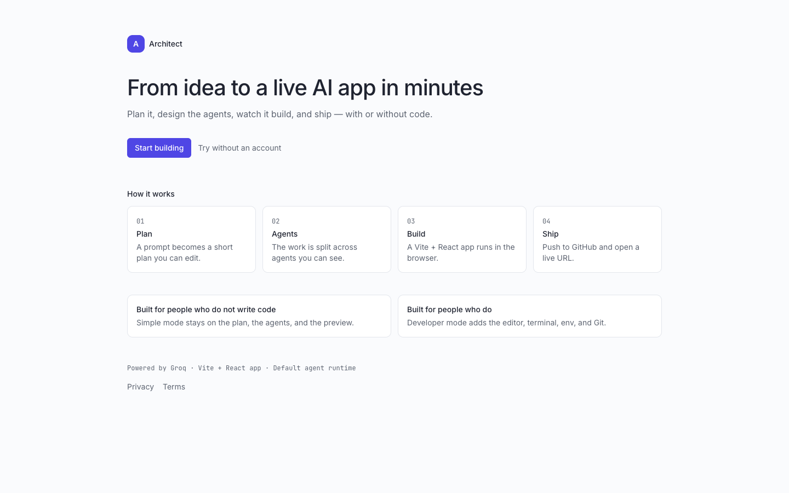
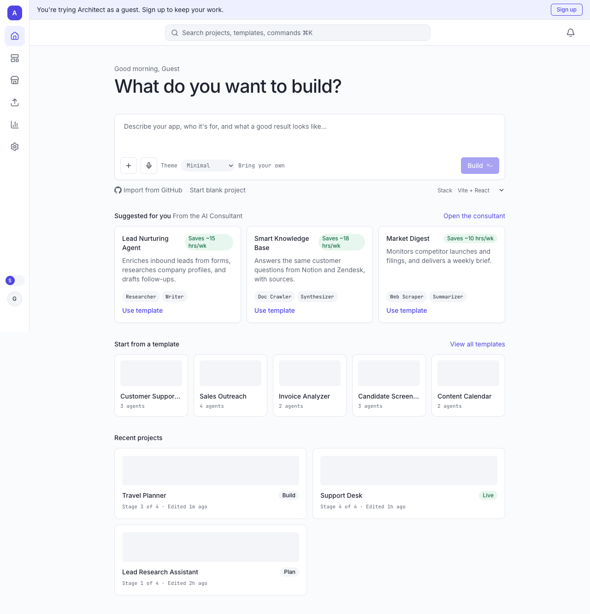
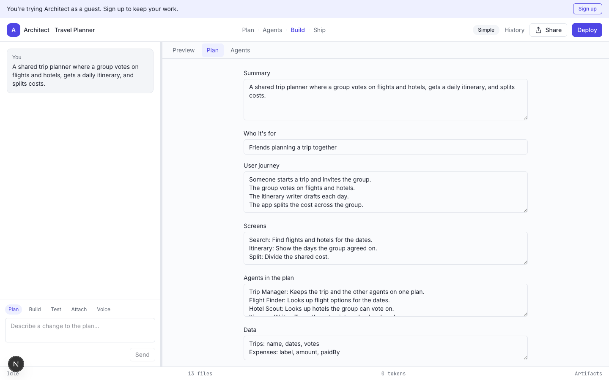
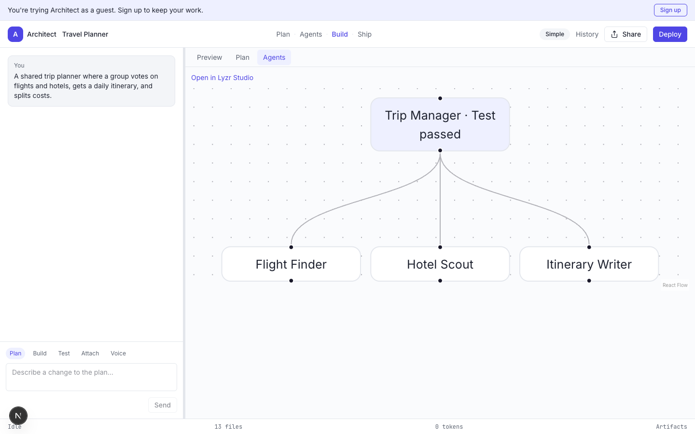
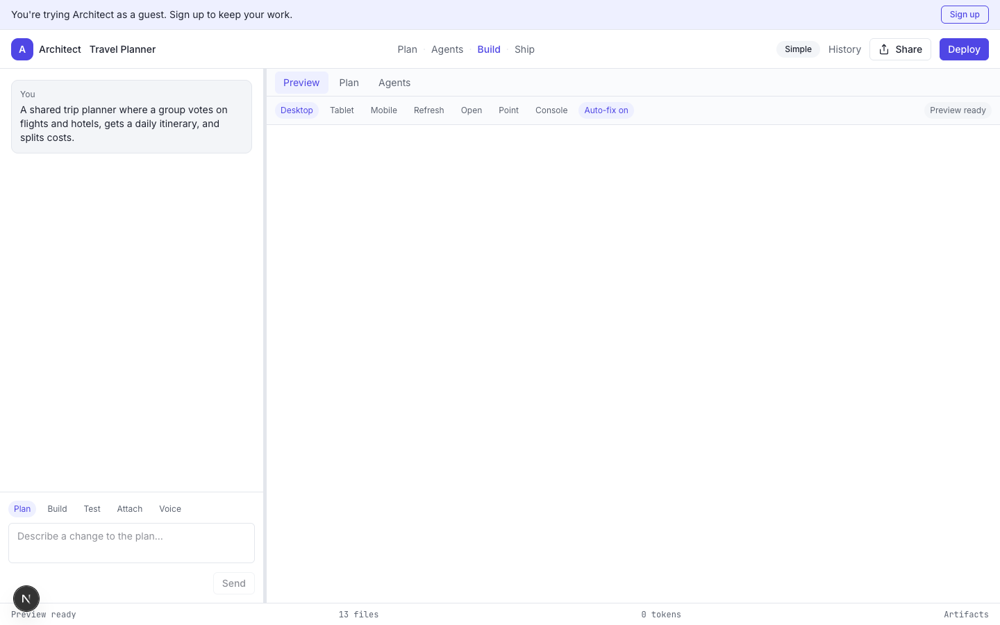
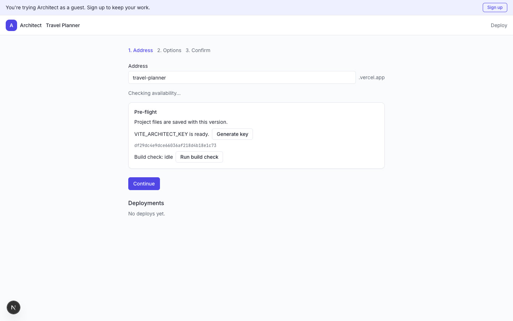
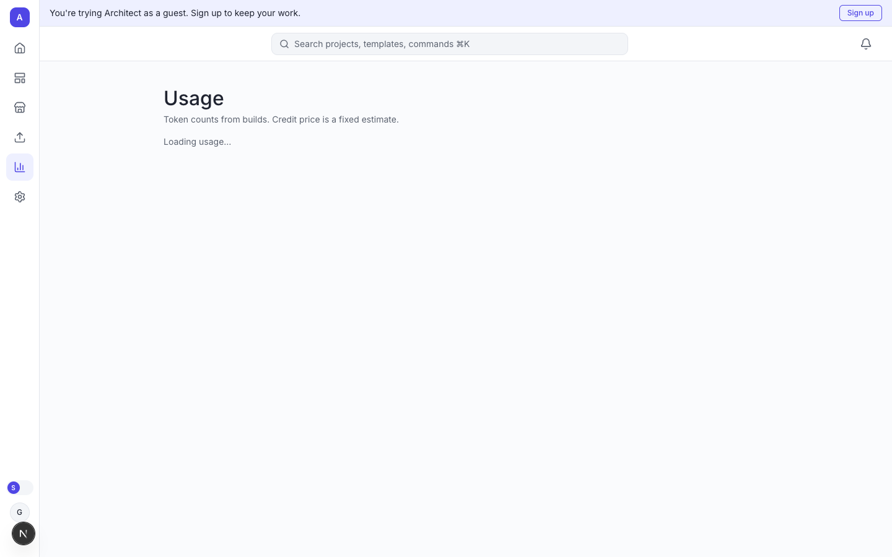

# Architect 2.0

A prompt becomes a deployed AI-agent application, for people who don't write code and for people who do.

- Product requirements: [prd.md](prd.md)
- How it's built: [architecture.md](architecture.md)
- Build order: [implementation_plan.md](implementation_plan.md)
- Assignment: [ASSIGNMENT.md](ASSIGNMENT.md)

Each phase is a separate folder. The current app is [phase 5 - ship](<phase%205%20-%20ship/>). Shared code is in [common](common/).

## Run

```bash
cp .env.example .env
pnpm install
pnpm dev
```

`pnpm dev` from this folder starts the integrated app in `phase 5 - ship`. That app includes the home shell, plan and agents, preview, GitHub and deploy, and the coverage screens.

Open [http://localhost:3000](http://localhost:3000). **Try without an account** lands on three seeded projects:

| Project | Stage | What you see |
|---|---|---|
| Travel Planner | Build | Plan, four agents, a Vite app, nine snapshots (one is a runtime error) |
| Support Desk | Live | A deployment history without calling Vercel |
| Lead Research Assistant | Plan | A plan waiting for approval |

`.env` stays in this folder. The phase folder reads it from the parent. There is no env file inside a phase folder.

Without Supabase keys, guest entry uses a local demo session. Google, GitHub and magic-link sign-in start once those keys are filled in. A new signed-in account gets the same three projects on first arrival.

`GROQ_API_KEY` turns on live plans and code generation. `VERCEL_TOKEN` turns on real deploys. `ENCRYPTION_KEY` encrypts saved GitHub tokens and project env values. Leave `VERCEL_TEAM_ID` empty unless the Vercel token belongs to a team. Upstash and the keep-alive token are optional.

```bash
pnpm typecheck
pnpm lint
pnpm test
pnpm test:e2e
```

## Production

### Hugging Face Space

The running Space is [Sankhua/project-ai](https://huggingface.co/spaces/Sankhua/project-ai). A push to `main` runs [Deploy to Hugging Face](.github/workflows/huggingface.yml), which uploads this repository to that Space and starts a rebuild. Add a Hugging Face write token as the `HF_TOKEN` repository secret first. The Space uses the Docker SDK. The root [Dockerfile](Dockerfile) builds [phase 5 - ship](<phase%205%20-%20ship/>) and listens on `0.0.0.0:7860`. The metadata at the top of this file (`sdk: docker`, `app_port: 7860`) is what the Space reads. Set `NEXT_PUBLIC_APP_URL` to `https://sankhua-project-ai.hf.space` before a rebuild.

In the Space settings, add `GROQ_API_KEY` and `ENCRYPTION_KEY` as secrets. Add `VERCEL_TOKEN` only if generated apps should really deploy. Leave the Supabase variables empty to keep **Try without an account**. `NEXT_PUBLIC_` names are read when the image is built, so set those before a rebuild if you turn on accounts.

Details are in [architecture.md](architecture.md) section 14.1.

### Render

The live app is [https://lyzr-ai-project.onrender.com](https://lyzr-ai-project.onrender.com). [render.yaml](render.yaml) is the Blueprint for that web service. It builds the root [Dockerfile](Dockerfile). The container listens on Render's `PORT`. Sign-in stays off (`ARCHITECT_AUTH=off`) so **Try without an account** works. Set `NEXT_PUBLIC_APP_URL` to `https://lyzr-ai-project.onrender.com` on the service. Add `GROQ_API_KEY` and `ENCRYPTION_KEY` in the Render dashboard for live plans and saved tokens. Leave the Supabase variables empty while sign-in is off. `NEXT_PUBLIC_` names are read when the image is built, so change them and redeploy.

### Vercel

Generated apps still go out through Vercel. For hosting this app on Vercel instead, the project root is `phase 5 - ship`. [vercel.json](<phase%205%20-%20ship/vercel.json>) pins functions to `bom1`. Set the variables from [architecture.md](architecture.md) section 14 on the Vercel project (Production and Preview). In the Supabase dashboard, add the production URL to the auth redirect allow list, and turn on Google, GitHub, and anonymous sign-in.

`KEEPALIVE_TOKEN` and `APP_URL` are GitHub Actions secrets. The [keep-alive workflow](.github/workflows/keepalive.yml) pings `/api/health` every day so a free Supabase project does not pause. The route answers only when the token matches.

CI runs typecheck, lint, unit tests, and a Playwright smoke (guest, demo project, preview, deploy wizard) from [.github/workflows/ci.yml](.github/workflows/ci.yml).

## Walkthrough

Screenshots of the path a reviewer takes:









A recorded pass of that path is in [docs/walkthrough.webm](docs/walkthrough.webm).

## Feature matrix

Status comes from [architecture.md](architecture.md) section 5. **Real** works end to end. **Partial** works on the main path. **Dummy** is a finished screen with mocked data.

| Area | Status |
|---|---|
| Sign-in (Google, GitHub, magic link) and guest `/try` | Real |
| AI Consultant, prompt library, Home, templates | Real |
| File upload and theme presets | Partial |
| Studio agent picker, bring-your-own design import | Dummy |
| Plan, agent graph, code generation, live preview, self-heal | Real |
| Agent test run, other frameworks, other stacks | Partial |
| Open in Lyzr Studio, artifacts | Dummy |
| Database viewer | Partial |
| Env variables, version history | Real |
| GitHub connect, push, import | Real |
| GitHub pull and branch switch | Partial |
| Deploy to a public URL | Real |
| Custom domain, analytics, marketplace publish | Dummy |
| Integrations and MCP | Dummy |
| Share, API and CLI, branch previews | Dummy |
| Usage and credits | Partial |
| Command palette, Simple / Developer mode | Real |
