# Architect 2.0 — Architecture

Build spec for **Architect 2.0**, the Lyzr hiring assignment described in [assignment.md](assignment.md). It is written so Cursor and Claude Code can implement it section by section. Product requirements are in [prd.md](prd.md) and the build order in [implementation_plan.md](implementation_plan.md).

**Stack:** Next.js 15 (App Router) + Supabase (Postgres, Auth, Storage) + Vercel hosting. All LLM work runs on **Groq**.

**Functional depth (hybrid):**

- **Real:** auth, database, Groq chat, plan/PRD generation, code generation, in-browser live preview, self-heal loop, GitHub repo create + push + import, Vercel deploy.
- **Partial:** agent runs (default framework only), branch listing, usage metering.
- **Dummy:** everything else. These are clickable flows with realistic states that show the product design.

## Contents

**Product:** [1 Overview](#1-overview-and-goals) · [2 Personas](#2-personas-and-dual-mode-ux) · [3 Routes](#3-information-architecture-and-route-map) · [4 User flows](#4-key-user-flows) · [5 Feature matrix](#5-feature-matrix) · [26 Competitive research](#26-competitive-research-and-feature-derivation) · [27 Surface specs](#27-feature-specifications-required-surfaces) · [30 Feature map](#30-feature-map)

**Architecture:** [6 System (context, layers, topology, trust)](#6-system-architecture) · [7 Frontend](#7-frontend-architecture) · [8 AI layer](#8-ai-layer-groq) · [9 Preview runtime](#9-preview-runtime-webcontainers) · [10 Data model](#10-data-model-supabase) · [11 API routes](#11-api-routes) · [12 Integrations](#12-integrations) · [28 Generated app](#28-generated-app-architecture) · [29 Knowledge pipeline](#29-knowledge-pipeline-attachments) · [31 Decisions](#31-architecture-decision-records-summary)

**Quality and delivery:** [13 Security](#13-security) · [14 Env vars](#14-environment-variables) · [15 Design system](#15-design-system) · [16 Delivery plan](#16-delivery-plan) · [17 Risks](#17-risks-and-fallbacks) · [18 Components](#18-component-inventory-and-ui-states) · [19 State and streaming](#19-client-state-stores-and-the-streaming-contract) · [20 Realtime](#20-realtime-and-collaboration) · [21 Observability](#21-observability-logging-and-analytics) · [22 Testing](#22-testing-and-ai-evaluation-strategy) · [23 Performance](#23-performance-caching-and-scalability) · [24 Accessibility](#24-accessibility-internationalization-and-responsive-design) · [25 CI/CD](#25-cicd-environments-and-operations) · [32 References](#32-references)

---

## 1. Overview and goals

Architect 2.0 is a vibe-coding platform that turns a prompt into a deployed **agentic application**. Today's Architect serves non-technical users. Version 2.0 keeps that path and adds a developer path on top of the same project model.

### How the judging priorities map to the architecture

| Judging priority | Architectural response |
|---|---|
| Design, UI/UX and flows (most important) | One workspace shell with a clear sequence of stages (Plan → Agents → Build → Ship). A design-token system. Every flow has empty, loading, error and success states. |
| Feature coverage (high) | The feature matrix (section 5) covers every current Architect feature plus developer features. Anything not wired to a real backend still gets a dummy flow. |
| Working functionality (plus points) | Supabase auth and database, Groq streaming, WebContainer preview, GitHub push, Vercel deploy — all real. |

### Product principles (first principles, not copied)

1. **One project, two lenses.** Non-technical users see outcomes (plan, agents, preview). Developers see the same project as code, files, terminal and diffs. The toggle changes the view, not the data.
2. **Always show what the AI is doing.** Every stage streams visible progress: plan sections appearing, files being written, install logs, errors being fixed.
3. **Approve before expensive work.** The plan is a checkpoint. Code generation starts only after the user approves or edits the plan.
4. **Nothing is lost.** Every AI change creates a snapshot. Any version can be previewed or restored.
5. **You own the output.** Export to GitHub and deploy are first-class actions, not buried settings.

---

## 2. Personas and dual-mode UX

| Persona | Needs | What they see |
|---|---|---|
| **Maya — ops lead, non-technical** | Automate a painful workflow without code. Needs to be guided. | AI Consultant onboarding, prompt library, plan in plain language, agent cards, live preview, one-click deploy. |
| **Dev — full-stack engineer** | Speed, control, ownership. Wants to import a repo, edit code, pick a framework and use their own keys. | Everything Maya sees, plus a code editor, file tree, terminal, diff view, env vars, framework picker, GitHub branches and a CLI/API view. |
| **Team admin** | Collaboration, cost control. | Sharing, roles, usage dashboard, workspace settings. |

### Simple / Developer toggle

- Stored per user in `profiles.mode` (`simple` | `developer`). It can be overridden per project.
- **Simple mode** workspace tabs: `Chat · Plan · Agents · Preview`.
- **Developer mode** adds: `Code · Terminal · Database · Env · Git`.
- Both modes share the same stores and API calls. Developer mode only mounts extra panels.

---

## 3. Information architecture and route map

```
/                         Marketing landing (logged out) or redirect to /home
/login                    Auth: email magic link, Google, GitHub
/try                      Guest entry: anonymous session + seeded demo project (no signup)
/auth/callback            Supabase OAuth callback
/onboarding               AI Consultant: role, time sinks, tools -> app ideas
/home                     Prompt box, recent projects, templates, prompt library
/templates                Starter templates (Simple) and framework starters (Developer)
/marketplace              Community apps (dummy): browse, clone
/import                   Import a GitHub repo or zip
/p/[id]                   Project workspace (default tab: Chat + Preview)
/p/[id]?tab=plan          PRD / plan document
/p/[id]?tab=agents        Agent graph + agent detail drawer
/p/[id]?tab=code          Monaco editor + file tree (Developer)
/p/[id]?tab=database      Collections / tables viewer
/p/[id]?tab=env           Environment variables (Developer)
/p/[id]?tab=git           GitHub: repo, branches, push/pull, commits
/p/[id]/deploy            Deploy flow: target, domain, analytics, marketplace
/p/[id]/history           Snapshots timeline + restore
/p/[id]/settings          Project name, theme, sharing, danger zone
/usage                    Credits / token usage per project and stage
/settings                 Profile, mode, connected accounts, API keys (BYOK)
```

### Workspace layout (`/p/[id]`)

```
+----------------------------------------------------------------------------------+
| TopBar: project name | stage stepper (Plan > Agents > Build > Ship) | mode | Share | Deploy |
+----------------------+-----------------------------------------------------------+
| Left: Chat panel     | Right: tabbed canvas                                      |
|  - message stream    |  Preview | Plan | Agents | Code | Database | Env | Git     |
|  - build step cards  |                                                           |
|  - composer          |  Preview toolbar: device size, refresh, open in new tab,  |
|    (+ attach, theme, |  console drawer                                           |
|     plan/build, test,|                                                           |
|     voice)           |                                                           |
+----------------------+-----------------------------------------------------------+
| Status bar: runtime state (booting / installing / ready / error) | snapshot id | credits used |
+----------------------------------------------------------------------------------+
```

Panels are resizable (`react-resizable-panels`). On narrow screens, chat and canvas become two tabs.

---

## 4. Key user flows

### 4.1 Main flow: prompt to deployed app

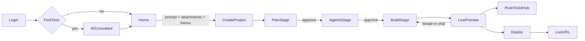

Step by step:

1. **Login.** Choose a provider. A new user gets a `profiles` row created by a database trigger.
2. **AI Consultant (first run, can be skipped).** Three questions: role, biggest time sinks, current tools. Groq returns 3–6 app ideas with estimated hours saved per week. Clicking one fills the home prompt.
3. **Home.** Prompt box with a `+` menu: attach files (PDF/DOCX/CSV become knowledge), pick a theme, add existing agents, open the prompt library. There is also a Simple/Developer toggle and a template strip.
4. **Create project.** `POST /api/projects` creates the row, then routes to `/p/[id]` and starts planning.
5. **Plan stage.** The PRD streams in: summary, user journey, screens, agents, data model, integrations, open questions. The user can edit inline or chat to refine. The **Approve plan** button moves to Agents.
6. **Agents stage.** An agent graph (manager plus sub-agents), each with role, instructions, tools, knowledge and framework. Users can test one agent in a side drawer. **Approve agents** moves to Build.
7. **Build stage.** Chat shows step cards ("Writing 14 files", "Installing dependencies", "Starting preview", "Fixing 1 error"). Files stream into the WebContainer. The preview becomes ready.
8. **Iterate.** Chat edits run as diff-sized code changes. The **Plan** toggle in the composer discusses a change without writing code. The **Test** toggle runs the self-heal check after every build.
9. **GitHub.** Connect (OAuth), create a repo, push. Later changes auto-commit, or you can push manually.
10. **Deploy.** Choose a subdomain name, then deploy. Watch the status (Queued → Building → Ready). You get the live URL, a copy button and a QR code.

### 4.2 Import an existing project (developer)

1. `/import` → pick a GitHub repo (listed through the user's token) or upload a zip.
2. The server reads the repo tree (size-limited, see section 17) and writes `project_files`.
3. Framework detection from `package.json` (Vite/Next/CRA). Unsupported frameworks open in code-only mode with a banner.
4. Architect generates a **reverse PRD** (a plan inferred from the code) so non-technical teammates can understand the project.
5. The workspace opens in Developer mode with preview booted.

### 4.3 Iterate with Plan Mode

1. Toggle **Plan** in the composer, then describe a change ("add Stripe billing").
2. `gpt-oss-120b` returns a change plan: affected files, new agents, risks. No files are written.
3. **Apply plan** switches to Build and runs code generation with the change plan as context.
4. The PRD document is updated so it always reflects the current app.

### 4.4 Restore a version

History tab → snapshot timeline (who, when, what prompt, files changed) → preview that snapshot → **Restore** (creates a new snapshot; nothing is deleted).

### 4.5 Authentication

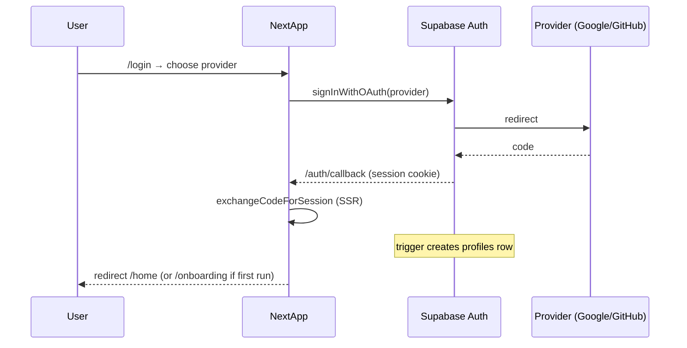

Middleware (`lib/supabase/middleware.ts`) refreshes the session on every request and guards `(app)` and `/p/*` routes; unauthenticated hits redirect to `/login`, except `/try`.

### 4.6 Guest onboarding

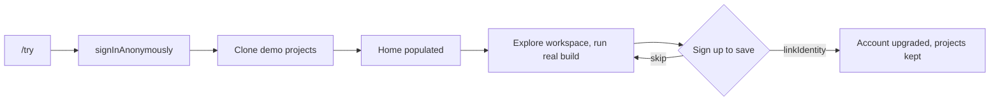

### 4.7 Deploy

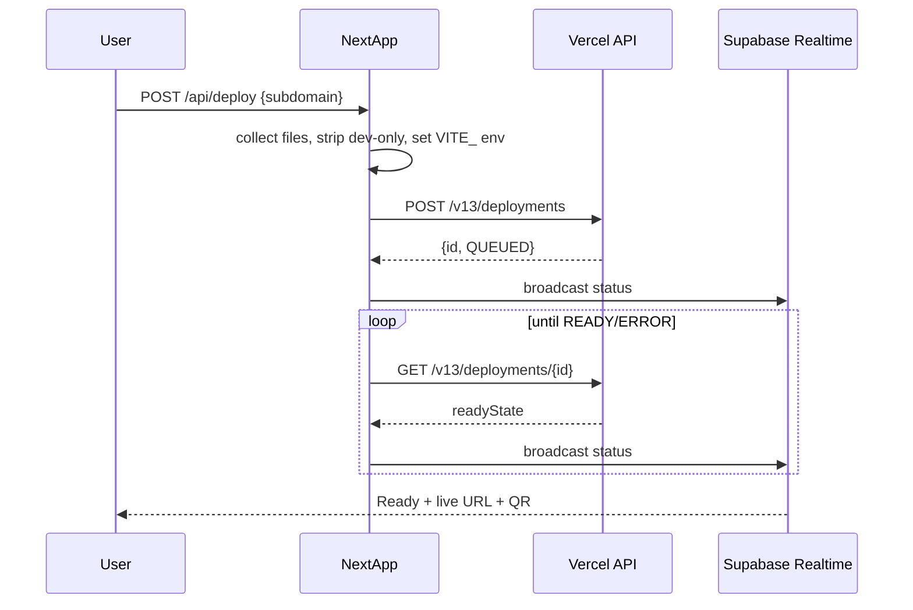

---

## 5. Feature matrix

**Status legend:** **Real** = works end to end. **Partial** = core path works, edges are mocked. **Dummy** = full UI flow with mocked data or latency, no backend effect.

### 5.1 Current Architect features (must be kept)

| Area | Feature | Status | Notes |
|---|---|---|---|
| Auth | Email magic link, Google, GitHub sign-in | Real | Supabase Auth |
| Onboarding | AI Consultant (role, time sinks, tools → ideas with hours saved) | Real | `gpt-oss-20b`; optional web research through `groq/compound-mini` |
| Home | Prompt box, recent projects, templates | Real | |
| Home | Prompt library (by role/task) | Real | Static JSON seed in `lib/prompts/library.ts` |
| Home | Attach files as knowledge (PDF/DOCX/TXT/CSV) | Partial | Upload to Storage + text extraction; retrieval with Postgres full-text search (section 29), not a vector DB |
| Home | Theme presets + bring-your-own design system | Partial | 8 presets real; Figma/PDF/GitHub import is dummy |
| Home | Add existing Studio agents | Dummy | Picker with mocked agents |
| Plan | PRD generation, inline edit, refine by chat | Real | `gpt-oss-120b`, structured output |
| Plan | Plan Mode for changes | Real | |
| Agents | Agent graph, roles, tools, knowledge | Real | Specs generated and stored |
| Agents | Test one agent | Partial | Runs through Groq with the agent's instructions; tools are mocked |
| Agents | Open in Lyzr Studio | Dummy | External link placeholder |
| Build | Code generation, streaming file writes | Real | Structured file operations |
| Build | Live preview | Real | WebContainers |
| Build | Self-heal / testing agent | Real | Captures build and console errors; up to 3 fix attempts |
| Build | Artifacts (docs, slides, reports) | Dummy | Artifact cards with mocked files |
| Data | Managed database + auth inside generated apps | Partial | Database viewer shows the generated app's collections from local JSON storage; Supabase wiring for generated apps is dummy |
| Data | Env variables | Real | Encrypted in `project_env`; injected into preview |
| GitHub | Connect, create repo, push, auto-commit | Real | Octokit + Git Data API |
| GitHub | Pull, branch switch | Partial | Branch list real; switching is dummy |
| GitHub | Import repo | Real | Size-limited |
| Deploy | Deploy to public URL | Real | Vercel `POST /v13/deployments` |
| Deploy | Rename subdomain | Partial | Vercel project name; availability check real |
| Deploy | Custom domain, analytics, publish to marketplace | Dummy | |
| Integrations | Gmail, Slack, Notion, HubSpot, Jira, etc. | Dummy | Connect cards with OAuth-like mock |
| Integrations | MCP servers, custom tools | Dummy | Form + mocked tool list |
| Agents | GitAgent (agents as repos: `SOUL.md`, `RULES.md`, `DUTIES.md`, `agent.yaml`) | Partial | Files generated into the project; no runtime |
| Collab | Share app with teammates, roles | Dummy | Invite modal with mocked members |
| Billing | Usage / credits per stage and agent | Partial | Real token counts from Groq responses; credit price is a constant |
| Support | Help + live chat | Dummy | |
| Marketplace | Browse / clone community apps | Dummy | Seeded list; clone copies a template project (real) |

### 5.2 New developer features (Architect 2.0 additions)

| Feature | Status | Notes |
|---|---|---|
| Guest / demo mode (enter without signup, seeded demo project) | Real | Anonymous Supabase session; see section 12.4 |
| Simple / Developer mode toggle | Real | |
| Monaco code editor + file tree | Real | Edits write to WebContainer and `project_files` |
| Terminal (xterm) wired to WebContainer shell | Real | |
| Diff view per AI change | Real | Diff between snapshots |
| Select an element in preview → edit with AI | Partial | Click-to-select in iframe sends component path + prompt; works for generated components |
| Framework picker for agents (Lyzr, LangGraph, CrewAI, OpenAI Agents SDK, GitAgent) | Partial | All scaffold code files; only the default (Groq-backed TypeScript agent) runs |
| Stack/template picker (Vite React, Next.js, Astro, Python FastAPI) | Partial | Vite React real; others scaffold only, preview disabled |
| Bring your own model key (Groq/OpenAI/Anthropic) | Partial | Groq real; others stored, UI only |
| Version history + restore | Real | Snapshots |
| API and CLI access (`architect deploy`) | Dummy | Docs page with tokens UI |
| Branch previews (preview URL per branch) | Dummy | |
| Cost/latency view per agent | Partial | Token counts real |
| Keyboard command palette (Cmd+K) | Real | `cmdk` |

### 5.3 Cross-cutting surfaces (complete the product)

| Feature | Status | Notes |
|---|---|---|
| Guest / demo mode | Real | Anonymous session + seeded projects (section 12.4) |
| Global search (projects, files, commands) | Real | Inside the command palette |
| Notifications / activity feed | Dummy | Deploy done, build failed, teammate joined; bell in top bar |
| Onboarding product tour | Real | First-run coach marks over the workspace (dismissible) |
| Settings: profile, mode, connected accounts, BYOK | Real | `/settings`; API keys stored encrypted |
| Usage / credits dashboard + plan tier badge | Partial | Charts real; upgrade CTA dummy |
| Theme (app light/dark) | Real | System-aware, toggle in settings |
| Empty/error/404 pages, legal (privacy/terms) | Real | Static, part of a shippable product |
| Shortcuts help sheet ("?") | Real | Mirrors section 24 keyboard map |
| Export project as zip / import zip | Real | Sections 11, 12 |

---

## 6. System architecture

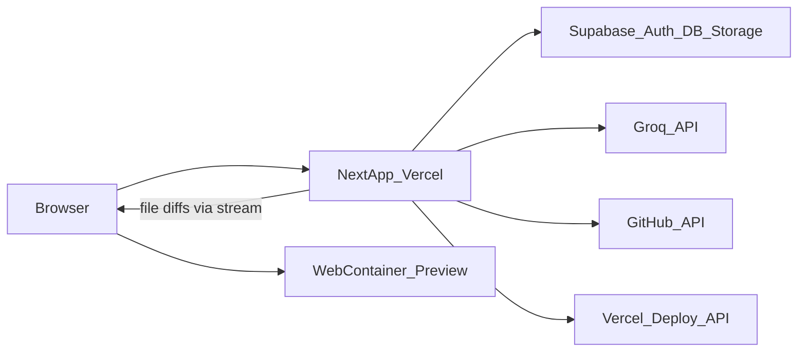

| Component | Responsibility | Runs where |
|---|---|---|
| **Next.js app** | UI, route handlers (`app/api/*`), server actions, streaming AI responses | Vercel (Node runtime for AI/GitHub/deploy routes; set `maxDuration` 60–300s) |
| **WebContainer** | Runs the generated app (`npm install`, `vite dev`) inside the user's browser tab | Client |
| **Supabase** | Auth, Postgres (projects, files, messages, snapshots), Storage (uploads, zip exports), Realtime (deploy status, collaboration presence) | Supabase cloud |
| **Groq** | All LLM calls (router, consultant, plan, agents, codegen, fix, transcription) | Groq cloud, OpenAI-compatible API |
| **GitHub** | Repo create, commit, import, branch list | GitHub REST |
| **Vercel API** | Deploy generated apps as separate Vercel projects | Vercel REST |

### Why this split

- **Preview in the browser, not in cloud sandboxes.** No per-user container cost, no cold-start queue, and preview updates arrive in about a second through Vite hot reload. The trade-off (browser support, no native modules) is covered in section 17.
- **The server owns the source of truth.** Files live in `project_files`. The WebContainer is a disposable mirror that is rebuilt on reload from the database.
- **All secrets stay server-side.** The Groq key, GitHub tokens and the Vercel token are never sent to the client.

### 6.1 System context (who talks to Architect)

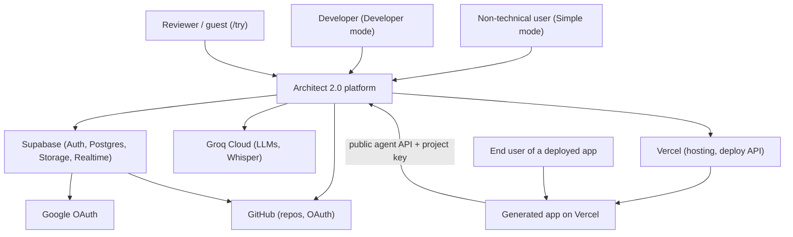

### 6.2 Layered architecture (detailed, with data flows)

Numbers on the arrows match the flow table below the diagram.

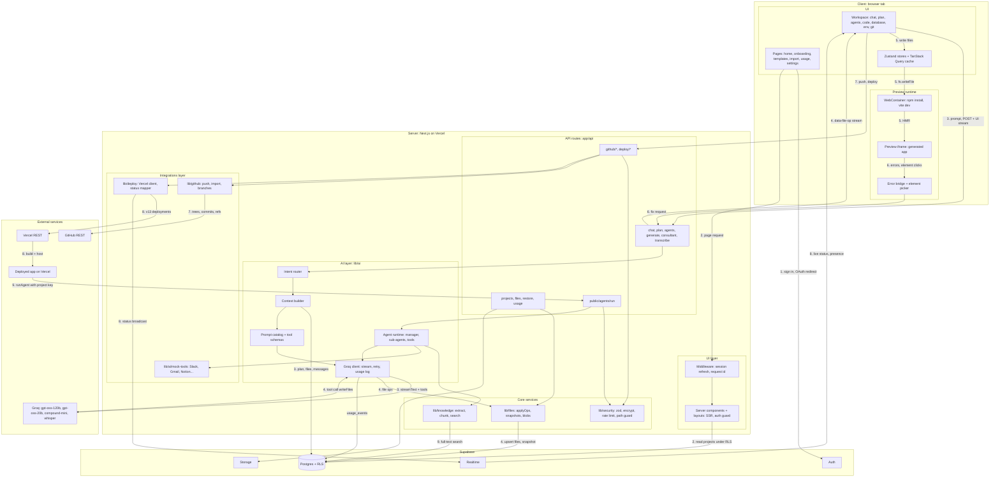

**Main data flows**

| # | Flow | Path | Payload |
|---|---|---|---|
| 1 | Sign in | Pages → Supabase Auth → callback → session cookie | OAuth code, session |
| 2 | Load a page | Browser → middleware (refresh session) → server component → Postgres under RLS | Project list, profile |
| 3 | Send a prompt | Workspace → AI route → router → context builder (reads Postgres) → prompt catalog → Groq | Message, plan, relevant files |
| 4 | Save generated code | Groq tool call → file service → Postgres (files + snapshot) → streamed back to workspace | `writeFiles` ops, `data-file-op` parts |
| 5 | Update the preview | Workspace → runtime store → WebContainer file write → Vite hot reload | File contents |
| 6 | Self-heal | Preview iframe → error bridge → AI route with `mode: fix` → back to step 3 | Normalized errors |
| 7 | Push to GitHub | Workspace → integration route → security checks → GitHub service → GitHub Git Data API | Changed files, commit message |
| 8 | Deploy | Integration route → Vercel deployments API → build and host → status broadcast through Realtime | Files, env, deployment status |
| 9 | Agents in a deployed app | Deployed app → public agent route (key, rate limit) → agent runtime → knowledge search + tools → Groq | Agent name, input, streamed answer |

Every server call also passes through the security service (session or key check, zod validation, rate limit) and logs token usage to `usage_events`. Only some of those arrows are drawn, to keep the diagram readable.

**Layer rules**

| Layer | May call | Must not |
|---|---|---|
| Client UI | Route handlers, Supabase Auth, Realtime (read), WebContainer | Call Groq, GitHub or Vercel directly; hold secrets |
| Preview runtime | Only its own iframe and the parent via `postMessage` | Reach Architect APIs with the user session |
| Route handlers | Domain services, Supabase (user-scoped client) | Contain business logic beyond validation and auth checks |
| Domain services | External APIs, Supabase (service role only in `fileSvc` blobs and `usageSvc`) | Import React or client code |

### 6.3 Deployment topology

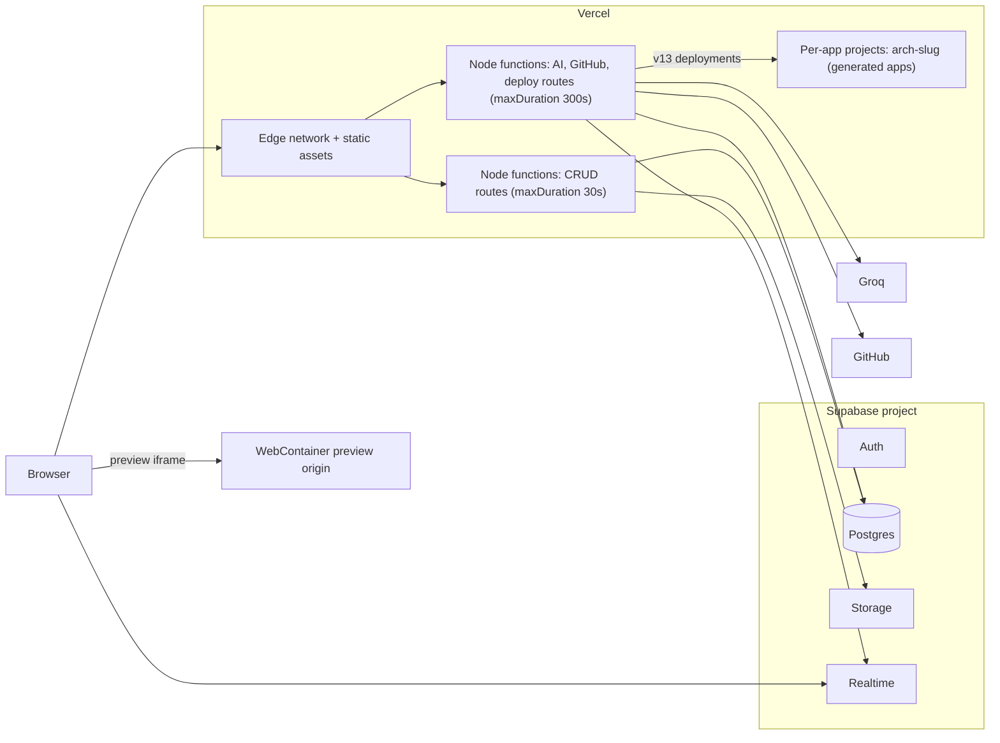

- One Supabase project and one Vercel project host Architect itself. Each deployed user app is its own Vercel project, so user builds never affect the platform.
- Region: put the Vercel functions and the Supabase project in the same region (for India-based reviewers, `bom1` and `ap-south-1`) to keep database round trips short.

### 6.4 Trust boundaries

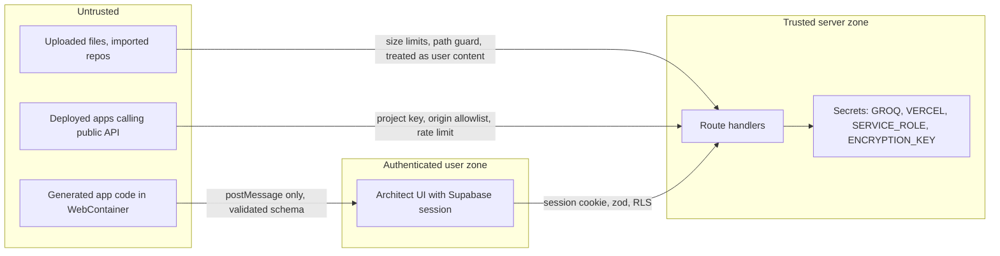

Every arrow that crosses into the trusted zone is validated with zod and checked for membership or key. The preview iframe runs on a separate origin, so generated code cannot read Architect cookies.

### Build pipeline

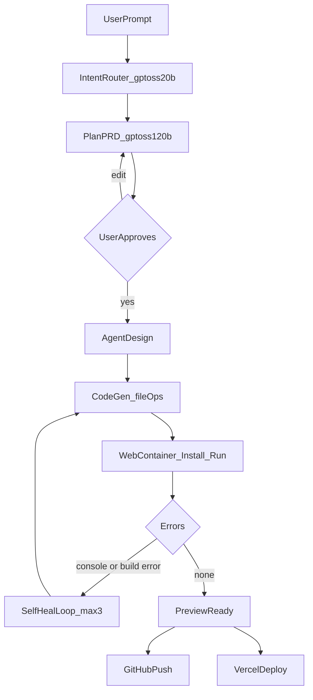

- The router classifies each chat message as `plan_change`, `code_change`, `question` or `agent_change` and sends it to the matching stage.
- Code generation returns **structured file operations** through a tool call (`writeFiles`), never free-form markdown. This makes parsing reliable and lets file cards stream in.
- After each successful write batch, the server stores a **snapshot** (a manifest of file paths and content hashes).

### Sequence: one code change

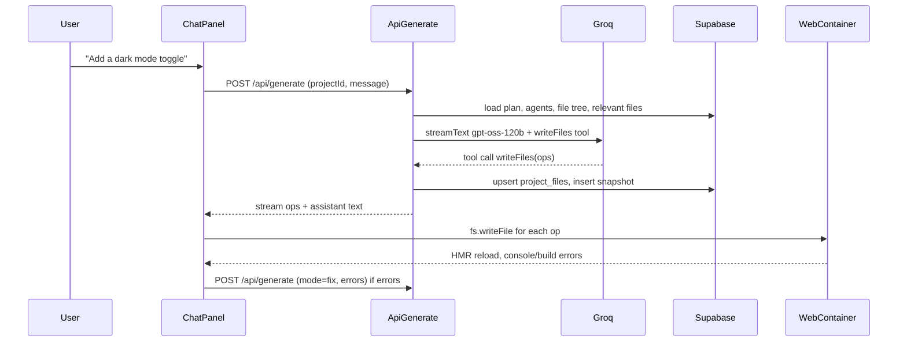

---

## 7. Frontend architecture

### Folder layout

Each phase is a folder in the repository root, named for what it covers (`phase 0 - home workspace shell/`, then `phase 1 - plan agents code/`, and so on). The tree below is inside that folder. The only env file is `Lyzr AI/.env`, not inside the phase folder.

```
app/
  (marketing)/page.tsx
  (auth)/login/page.tsx
  auth/callback/route.ts
  (app)/layout.tsx                 # auth guard, sidebar, command palette
  (app)/home/page.tsx
  (app)/onboarding/page.tsx
  (app)/import/page.tsx
  (app)/templates/page.tsx
  (app)/marketplace/page.tsx
  (app)/usage/page.tsx
  (app)/settings/page.tsx
  p/[id]/layout.tsx                # COOP/COEP scoped here (see section 9)
  p/[id]/page.tsx                  # workspace shell
  p/[id]/deploy/page.tsx
  p/[id]/history/page.tsx
  p/[id]/settings/page.tsx
  api/...                          # section 11
components/
  ui/                              # shadcn/ui primitives
  home/                            # PromptBox, PlusMenu, TemplateStrip, PromptLibrary
  onboarding/                      # ConsultantWizard, IdeaCard
  workspace/
    TopBar.tsx  StageStepper.tsx  StatusBar.tsx
    chat/       ChatPanel, MessageList, StepCard, FileOpCard, Composer
    preview/    PreviewFrame, DeviceToolbar, ConsoleDrawer, ElementPicker
    plan/       PlanDoc, PlanSection, ApproveBar
    agents/     AgentGraph (React Flow), AgentDrawer, AgentTestConsole, FrameworkPicker
    code/       FileTree, Editor (Monaco), DiffView
    terminal/   Terminal (xterm)
    database/   CollectionList, DocumentTable
    env/        EnvTable
    git/        GitPanel, BranchSelect, CommitList
  deploy/       DeployWizard, DeployStatus, DomainForm
lib/
  ai/          models.ts, prompts/*.ts, tools.ts, router.ts, context.ts
  runtime/     webcontainer.ts, sandpack-fallback.ts, error-bridge.ts
  github/      client.ts, push.ts, import.ts
  deploy/      vercel.ts
  supabase/    client.ts, server.ts, middleware.ts, types.ts (generated)
  templates/   vite-react/ (base files for generated apps)
  prompts/     library.ts
stores/
  project.ts   # files, active file, snapshots
  chat.ts      # messages, streaming state
  runtime.ts   # boot state, preview URL, errors
  ui.ts        # mode, panel sizes, active tab
```

### State and data

- **Server state:** TanStack Query for projects, messages, snapshots, deployments.
- **Client state:** Zustand stores above. `runtime.ts` is the single owner of the WebContainer instance.
- **Streaming:** the Vercel AI SDK `useChat` hook with custom data parts: `step` (progress card), `file-op` (file written), `plan-section`, `agent`.
- **Realtime:** Supabase Realtime channel `project:{id}` for deploy status updates and presence (who else is viewing).

### Key libraries

`next`, `react`, `tailwindcss`, `shadcn/ui`, `lucide-react`, `zustand`, `@tanstack/react-query`, `ai` + `@ai-sdk/groq`, `zod`, `@webcontainer/api`, `@codesandbox/sandpack-client` (fallback), `@monaco-editor/react` + `monaco-editor`, `@xterm/xterm`, `@xyflow/react` (agent graph), `react-resizable-panels`, `cmdk`, `octokit`, `@supabase/ssr`, `diff`, `sonner` (toasts), `recharts` (usage charts), `qrcode.react` (deploy QR code).

---

## 8. AI layer (Groq)

### 8.1 Models

All calls go through `@ai-sdk/groq` (OpenAI-compatible endpoint `https://api.groq.com/openai/v1`). Model IDs live in one file, `lib/ai/models.ts`:

```ts
export const MODELS = {
  reasoning: "openai/gpt-oss-120b",   // plan, codegen, agent design, fix
  fast: "openai/gpt-oss-20b",         // router, chat answers, titles, consultant
  research: "groq/compound-mini",     // consultant web research (built-in web_search)
  transcribe: "whisper-large-v3-turbo",
} as const;
```

| Role | Model | Why | Settings |
|---|---|---|---|
| Plan / PRD | `openai/gpt-oss-120b` | Production model, 131K context, strong reasoning | `reasoning_effort: "medium"`, temp 0.4 |
| Code generation | `openai/gpt-oss-120b` | Up to 65K completion tokens, tool calling | `reasoning_effort: "medium"`, temp 0.2 |
| Self-heal fix | `openai/gpt-oss-120b` | Needs precision | `reasoning_effort: "high"`, temp 0 |
| Router, chat, titles | `openai/gpt-oss-20b` | About 1000 tokens/s, cheap | `reasoning_effort: "low"` |
| AI Consultant research | `groq/compound-mini` | Built-in server-side web search | `enabled_tools: ["web_search"]` |
| Voice prompt | `whisper-large-v3-turbo` | Fast, cheap transcription | |

Groq retired several Llama models during 2026. Check the current list with `GET https://api.groq.com/openai/v1/models` at startup (log a warning if a configured ID is missing). Only IDs listed at [console.groq.com/docs/models](https://console.groq.com/docs/models) are treated as production.

Note: Compound systems support only their built-in tools. They cannot be combined with our own function tools, so they are used only for research, never for code generation.

### 8.2 Prompt catalog (`lib/ai/prompts/`)

| File | Stage | Output |
|---|---|---|
| `router.ts` | Intent classification | JSON `{ intent, confidence }` |
| `consultant.ts` | Onboarding ideas | JSON list of ideas `{ title, description, agents[], hoursSavedPerWeek }` |
| `plan.ts` | PRD | `proposePlan` tool call |
| `plan-change.ts` | Plan Mode | Change plan `{ summary, files[], agents[], risks[] }` |
| `agents.ts` | Agent design | `defineAgent` tool calls |
| `codegen.ts` | Build | `writeFiles` tool calls |
| `fix.ts` | Self-heal | `writeFiles` tool calls, limited to files named in the error |
| `reverse-plan.ts` | Repo import | PRD from existing code |

Every system prompt includes: the template's conventions (Vite + React + Tailwind, file layout, allowed dependencies), the chosen theme tokens, and the rule "only output tool calls for file changes".

### 8.3 Tool schemas (zod, `lib/ai/tools.ts`)

```ts
const FileOp = z.discriminatedUnion("op", [
  z.object({ op: z.literal("create"), path: z.string(), content: z.string() }),
  z.object({ op: z.literal("update"), path: z.string(), content: z.string() }),
  z.object({ op: z.literal("delete"), path: z.string() }),
]);

export const writeFiles = tool({
  description: "Create, update or delete files in the project.",
  inputSchema: z.object({
    summary: z.string(),
    ops: z.array(FileOp).max(40),
    dependencies: z.record(z.string()).optional(), // added to package.json
  }),
});

export const proposePlan = tool({
  inputSchema: z.object({
    title: z.string(),
    summary: z.string(),
    audience: z.string(),
    userJourney: z.array(z.string()),
    screens: z.array(z.object({ name: z.string(), purpose: z.string(), components: z.array(z.string()) })),
    agents: z.array(z.object({ name: z.string(), role: z.string() })),
    dataModel: z.array(z.object({ collection: z.string(), fields: z.array(z.string()) })),
    integrations: z.array(z.string()),
    openQuestions: z.array(z.string()),
  }),
});

export const defineAgent = tool({
  inputSchema: z.object({
    name: z.string(),
    role: z.string(),
    instructions: z.string(),
    framework: z.enum(["default", "lyzr", "langgraph", "crewai", "openai-agents", "gitagent"]),
    model: z.string(),
    tools: z.array(z.string()),
    knowledge: z.array(z.string()),
    managedBy: z.string().nullable(), // manager agent name, null for root
  }),
});
```

Updates use whole-file `content` (not patches). This is simpler and more reliable with open-weight models. To keep outputs small, the codegen prompt tells the model to split components into small files.

### 8.4 Context building (`lib/ai/context.ts`)

1. Always include: plan summary, agent list, file tree (paths only), theme tokens, the last 10 messages.
2. Pick relevant files: files named in the message, files touched in the last snapshot, plus a keyword match over paths. Cap at about 60K tokens.
3. For fixes: the error text, the stack trace file, and its direct imports.

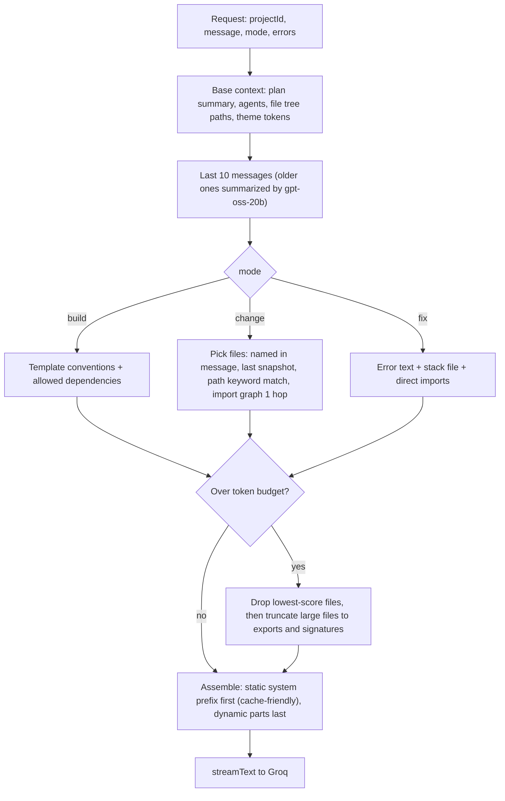

Token counts are estimated with a fast approximation (characters / 3.5) before the call and corrected from the response `usage` afterwards.

### 8.5 Token budgets, rate limits and retry

| Stage | Max input | Max output |
|---|---|---|
| Router | 4K | 200 |
| Plan | 16K | 8K |
| Codegen (first build) | 30K | 48K |
| Codegen (change) | 60K | 24K |
| Fix | 20K | 12K |

- Groq developer plan: about 250K tokens/minute and 1K requests/minute for GPT-OSS models. The server keeps a per-user token bucket in Postgres (`usage_events`) and returns `429` with a friendly retry time.
- On a Groq `429` or `5xx`: retry with exponential backoff (1s, 2s, 4s), respecting `retry-after`. After three failures, show a retry card in the chat.
- If a tool-call's JSON fails validation: re-prompt once with the zod error message.
- Log token usage from each response (`usage.inputTokens`, `usage.outputTokens`) to `usage_events` by stage and agent. This feeds the usage page.

### 8.6 Agent runtime (default framework)

`POST /api/agents/run` loads the agent spec and calls `gpt-oss-120b` with the agent's instructions as the system prompt. Tools are mocked function tools that return canned data. For a manager agent, the route runs sub-agents one after another and combines their outputs. The other frameworks (LangGraph, CrewAI, OpenAI Agents SDK, GitAgent) generate framework-specific code files into `/agents/<name>/` but do not run in the preview.

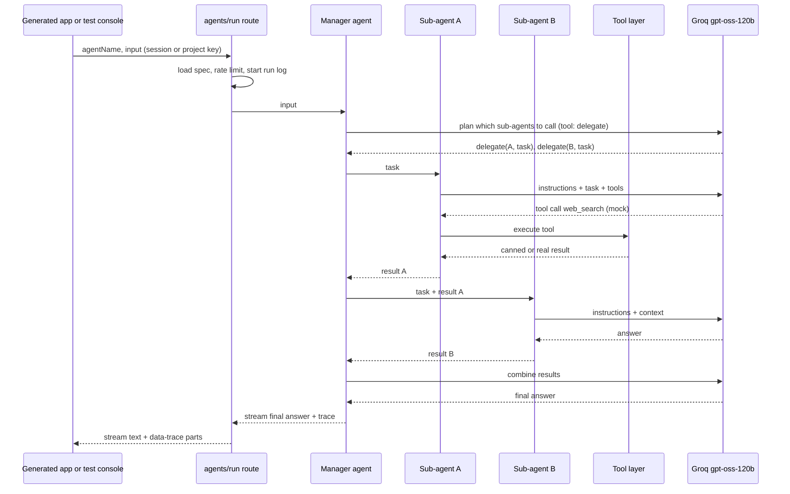

**Runtime details**

| Concern | Rule |
|---|---|
| Delegation | Managers get one tool per sub-agent (`delegate_<name>`). Maximum depth 2, maximum 6 tool calls per run |
| Tools | `lib/ai/mock-tools.ts` returns canned data for integrations; `browser_search` (Groq built-in on GPT-OSS) is real when the agent has the "Web search" tool |
| Knowledge | If the agent has knowledge files, the top 5 matching chunks (section 29) are added to the prompt |
| Trace | Each step is logged to `agent_runs` (input, steps, tokens, ms) and streamed as `data-trace` so the test console can show a timeline |
| Limits | 60 seconds per run, 8K output tokens, per-key rate limit on the public route |

`agent_runs` table (added to section 10.2):

```sql
create table agent_runs (
  id uuid primary key default gen_random_uuid(),
  project_id uuid not null references projects on delete cascade,
  agent_name text not null,
  source text not null check (source in ('test','preview','deployed')),
  input text,
  output text,
  steps jsonb,                             -- [{agent, tool, ms, tokens}]
  input_tokens int default 0,
  output_tokens int default 0,
  duration_ms int,
  status text not null default 'ok',
  created_at timestamptz default now()
);
alter table agent_runs enable row level security;
create policy "members read runs" on agent_runs for select using (is_member(project_id));
```

---

## 9. Preview runtime (WebContainers)

### 9.1 Lifecycle (`lib/runtime/webcontainer.ts`)

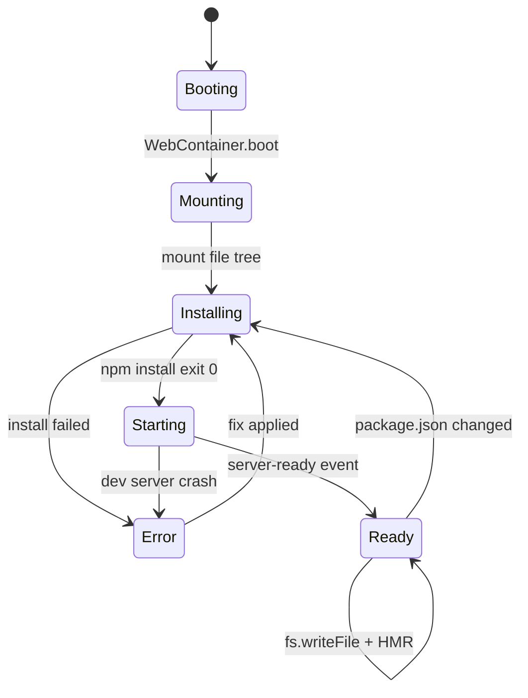

1. **Boot** once per tab: `WebContainer.boot()` (only one instance allowed; keep it in the `runtime` store).
2. **Mount:** convert `project_files` into a `FileSystemTree` and call `wc.mount(tree)`.
3. **Install:** `wc.spawn("npm", ["install"])`, streaming output to the terminal and the status bar. Cache: skip if the `package.json` hash is unchanged since the last install.
4. **Start:** `wc.spawn("npm", ["run", "dev"])`. On `wc.on("server-ready", (port, url))`, set the iframe `src`.
5. **Update:** apply file ops with `wc.fs.writeFile` / `wc.fs.rm`. Vite hot-reloads. If `package.json` changes, reinstall.

### 9.2 Cross-origin isolation headers, scoped

WebContainers need `SharedArrayBuffer`, which requires cross-origin isolation. Set the headers **only** on workspace routes, so login redirects and third-party embeds elsewhere are not affected:

```ts
// next.config.ts
async headers() {
  return [{
    source: "/p/:path*",
    headers: [
      { key: "Cross-Origin-Embedder-Policy", value: "require-corp" },
      { key: "Cross-Origin-Opener-Policy", value: "same-origin" },
    ],
  }];
}
```

Any cross-origin asset loaded on `/p/*` (avatars, fonts) must be served with CORP/CORS headers or proxied.

### 9.3 Error capture bridge (`lib/runtime/error-bridge.ts`)

- **Build errors:** parse Vite output from the dev-server process (`[plugin:vite...]`, `error TS`, `Failed to resolve import`).
- **Runtime errors:** the template's `index.html` includes a small script that listens to `window.onerror`, `unhandledrejection` and `console.error`, then sends `postMessage({ type: "architect:error", ... })` to the parent. The workspace listens and collects errors.
- **Self-heal loop:** errors are debounced (1.5s) and deduplicated. If **Test** is on (default on), the client calls `/api/generate` with `mode: "fix"`. At most 3 attempts per build; after that, show an error card with "Fix with AI" and "Show details" buttons.

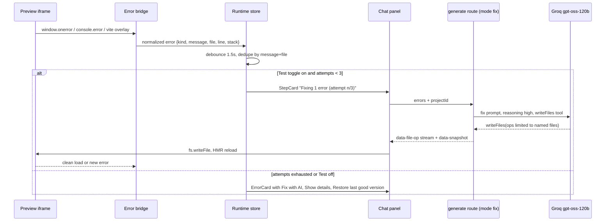

Normalized error shape:

```ts
type PreviewError = {
  kind: "build" | "runtime" | "console" | "install";
  message: string;
  file?: string;   // src/components/Header.tsx
  line?: number;
  stack?: string;
  at: number;      // epoch ms
};
```

A build counts as healthy when the preview has loaded and no new error arrives for 3 seconds. The last healthy snapshot is marked `snapshots.healthy = true`, so "Restore last good version" is always available.

### 9.4 Element picker (Developer mode)

The template injects `data-arch-src="path:line"` attributes during dev (a small Vite plugin). Picker mode sends clicks to the parent, which shows the component path and pre-fills the composer: "In `src/components/Header.tsx`: ...".

### 9.5 Fallback

If `crossOriginIsolated` is false or boot fails (older Safari, mobile), fall back to **Sandpack** (`loadSandpackClient` with the `vite-react` environment). Hot-reload through `client.updateSandbox(files)`. The terminal is hidden in fallback mode, and a banner explains it.

### 9.6 Generated-app template (`lib/templates/vite-react/`)

```
package.json          vite, react, react-dom, react-router-dom, tailwindcss, lucide-react
index.html            + error bridge script
vite.config.ts        + data-arch-src plugin (dev only)
src/main.tsx
src/App.tsx           router shell
src/theme.css         theme tokens as CSS variables
src/lib/agents.ts     client that calls the Architect agent-run API
src/lib/db.ts         localStorage-backed collections (database tab reads these)
src/components/       generated
src/pages/            generated
```

Allowed dependency list lives in the codegen prompt. It is limited to pure-JS packages, because WebContainers cannot build native modules.

---

## 10. Data model (Supabase)

### 10.1 Entity overview

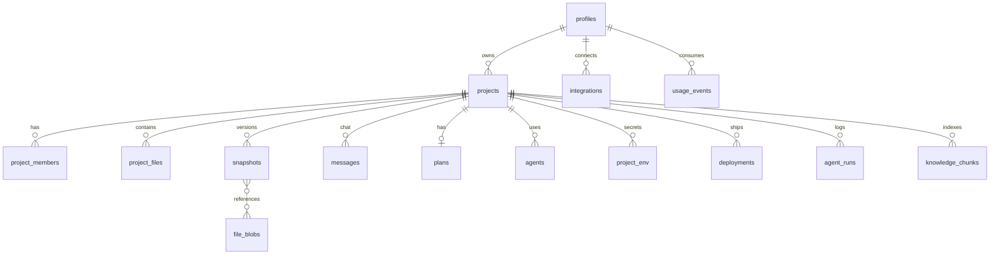

`agent_runs` is defined in section 8.6 and `knowledge_chunks` in section 29.

### 10.2 Schema (`supabase/migrations/0001_init.sql`)

```sql
create table profiles (
  id uuid primary key references auth.users on delete cascade,
  full_name text,
  avatar_url text,
  mode text not null default 'simple' check (mode in ('simple','developer')),
  onboarding jsonb,                       -- consultant answers
  created_at timestamptz default now()
);

create table projects (
  id uuid primary key default gen_random_uuid(),
  owner_id uuid not null references profiles on delete cascade,
  name text not null,
  slug text unique,
  description text,
  stage text not null default 'plan' check (stage in ('plan','agents','build','ship')),
  template text not null default 'vite-react',
  theme jsonb,
  mode_override text check (mode_override in ('simple','developer')),
  github_repo text,                       -- "owner/name"
  github_branch text default 'main',
  current_snapshot_id uuid,
  public_key text not null default encode(gen_random_bytes(16),'hex'), -- used by deployed apps to call agent API
  created_at timestamptz default now(),
  updated_at timestamptz default now()
);

create table project_members (
  project_id uuid references projects on delete cascade,
  user_id uuid references profiles on delete cascade,
  role text not null check (role in ('owner','editor','viewer')),
  primary key (project_id, user_id)
);

create table project_files (
  project_id uuid references projects on delete cascade,
  path text not null,
  content text not null,
  sha text not null,                      -- sha1 of content
  updated_at timestamptz default now(),
  primary key (project_id, path)
);

create table snapshots (
  id uuid primary key default gen_random_uuid(),
  project_id uuid not null references projects on delete cascade,
  parent_id uuid references snapshots,
  message_id uuid,
  summary text,
  manifest jsonb not null,                -- { path: sha }
  healthy boolean not null default false, -- preview loaded with no errors for 3s
  commit_sha text,                        -- set after GitHub push
  created_by uuid references profiles,
  created_at timestamptz default now()
);

create table file_blobs (                 -- content-addressed storage for snapshot restore
  sha text primary key,
  content text not null
);

create table messages (
  id uuid primary key default gen_random_uuid(),
  project_id uuid not null references projects on delete cascade,
  role text not null check (role in ('user','assistant','system','tool')),
  kind text not null default 'chat',      -- chat | plan | step | error | fix
  content text,
  parts jsonb,                            -- AI SDK UI message parts
  created_by uuid references profiles,
  created_at timestamptz default now()
);

create table plans (
  project_id uuid primary key references projects on delete cascade,
  doc jsonb not null,                     -- proposePlan output
  approved_at timestamptz,
  version int not null default 1,
  updated_at timestamptz default now()
);

create table agents (
  id uuid primary key default gen_random_uuid(),
  project_id uuid not null references projects on delete cascade,
  name text not null,
  spec jsonb not null,                    -- defineAgent output
  position jsonb,                         -- graph x/y
  created_at timestamptz default now(),
  unique (project_id, name)
);

create table project_env (
  project_id uuid references projects on delete cascade,
  key text not null,
  value_encrypted bytea not null,         -- pgsodium / app-level AES-GCM
  primary key (project_id, key)
);

create table integrations (
  user_id uuid references profiles on delete cascade,
  provider text not null,                 -- github | vercel | groq_byok | ...
  access_token_encrypted bytea,
  account_login text,
  scopes text[],
  meta jsonb,
  updated_at timestamptz default now(),
  primary key (user_id, provider)
);

create table deployments (
  id uuid primary key default gen_random_uuid(),
  project_id uuid not null references projects on delete cascade,
  snapshot_id uuid references snapshots,
  provider text not null default 'vercel',
  provider_deployment_id text,
  status text not null default 'queued'
    check (status in ('queued','building','ready','error','canceled')),
  url text,
  subdomain text,
  logs text,
  created_by uuid references profiles,
  created_at timestamptz default now()
);

create table usage_events (
  id bigserial primary key,
  user_id uuid not null references profiles on delete cascade,
  project_id uuid references projects on delete set null,
  stage text not null,                    -- router | plan | agents | codegen | fix | agent_run | consultant
  agent_name text,
  model text not null,
  input_tokens int not null default 0,
  output_tokens int not null default 0,
  cached_tokens int not null default 0,
  created_at timestamptz default now()
);
create index on usage_events (user_id, created_at desc);
```

A trigger on `auth.users` insert creates the `profiles` row. A trigger on `projects` insert adds the owner to `project_members`.

### 10.3 Row Level Security

RLS is enabled on every table. Membership is checked by one helper:

```sql
create function is_member(p uuid, min_role text default 'viewer') returns boolean
language sql security definer stable as $$
  select exists (
    select 1 from project_members m
    where m.project_id = p and m.user_id = auth.uid()
      and case min_role
            when 'viewer' then true
            when 'editor' then m.role in ('editor','owner')
            when 'owner'  then m.role = 'owner'
          end
  );
$$;

alter table projects enable row level security;
create policy "members read"   on projects for select using (is_member(id));
create policy "owner insert"   on projects for insert with check (owner_id = auth.uid());
create policy "editors update" on projects for update using (is_member(id,'editor'));
create policy "owner delete"   on projects for delete using (is_member(id,'owner'));

-- Same pattern for project_files, snapshots, messages, plans, agents, deployments:
--   select using (is_member(project_id)); insert/update/delete using (is_member(project_id,'editor'))
-- project_env: select/modify only is_member(project_id,'editor'); values decrypted server-side only
-- profiles, integrations, usage_events: user_id = auth.uid()
```

`file_blobs` has no client policies. It is only reachable through the service role in route handlers.

### 10.4 Storage buckets

| Bucket | Content | Access |
|---|---|---|
| `uploads` | Attached knowledge files (`{projectId}/{file}`) | Members only (policy on the path prefix) |
| `exports` | Zip exports | Signed URLs, 1 hour |
| `avatars` | Profile images | Public read |

---

## 11. API routes

All routes live in `app/api/*/route.ts`. Each checks the Supabase session (`createServerClient`), validates the body with zod, and checks project membership. AI routes stream with the Vercel AI SDK UI message stream.

| Method + path | Purpose | Request | Response |
|---|---|---|---|
| `POST /api/projects` | Create project from prompt | `{ prompt, attachments?, theme?, template? }` | `{ id }` |
| `POST /api/consultant` | Onboarding ideas | `{ role, timeSinks[], tools[] }` | `{ ideas[] }` |
| `POST /api/upload` | Upload attachment as knowledge | `multipart file, projectId?` | `{ path, extractedChars }` — stores to `uploads` bucket + server-side text extraction |
| `POST /api/chat` | Router + answer or dispatch | `{ projectId, messages }` | UI stream (text + `data-intent`) |
| `POST /api/plan` | Generate or refine the PRD | `{ projectId, instruction? }` | UI stream (`data-plan-section`), stores `plans` |
| `POST /api/plan/approve` | Lock plan, move to agents | `{ projectId }` | `{ stage }` |
| `POST /api/agents/design` | Generate agent specs | `{ projectId }` | UI stream (`data-agent`) |
| `PUT /api/agents/[id]` | Persist agent edits from the drawer | `{ spec, position? }` | `{ id }` — validates against `defineAgent` schema |
| `POST /api/agents/run` | Test one agent (owner session) | `{ projectId, agentName, input }` | stream |
| `POST /api/public/agents/run` | Called by generated/deployed apps | header `x-architect-key`, `{ agentName, input }` | stream; rate limited per key |
| `POST /api/generate` | Codegen / change / fix | `{ projectId, message?, mode: "build"\|"change"\|"fix", errors? }` | UI stream (`data-step`, `data-file-op`), stores files + snapshot |
| `GET /api/projects/[id]/files` | Full file tree for mounting | | `{ files: {path, content}[] }` |
| `PUT /api/projects/[id]/files` | Manual edits from editor | `{ ops: FileOp[] }` | `{ snapshotId }` |
| `POST /api/projects/[id]/restore` | Restore a snapshot | `{ snapshotId }` | `{ snapshotId }` (new) |
| `POST /api/projects/[id]/export` | Zip export of current files | `{ snapshotId? }` | `{ url }` — writes to `exports` bucket, signed URL (1h) |
| `POST /api/import/zip` | Import an uploaded zip into a new project | `multipart zip` | `{ projectId }` — same size limits as GitHub import |
| `POST /api/marketplace/[id]/clone` | Clone a community app / template | `{ }` | `{ projectId }` — copies files, plan, agents into a new project |
| `GET /api/github/repos` | List user repos for import | | `{ repos[] }` |
| `GET /api/github/branches` | List branches of linked repo | `?projectId` | `{ branches[] }` |
| `POST /api/github/push` | Create repo if needed, commit current files | `{ projectId, message?, repoName?, private? }` | `{ repo, commitSha, url }` |
| `POST /api/github/import` | Import repo into a new project | `{ repo, branch? }` | `{ projectId }` |
| `GET /api/deploy/check` | Subdomain availability for the deploy wizard | `?subdomain` | `{ available, suggestion? }` — checks Vercel project names and the `deployments` table |
| `POST /api/deploy` | Deploy current snapshot to Vercel | `{ projectId, subdomain? }` | `{ deploymentId }` |
| `GET /api/deploy/[id]/status` | Poll Vercel and update row | | `{ status, url }` |
| `POST /api/transcribe` | Voice prompt | `multipart audio` | `{ text }` |
| `GET /api/usage` | Usage dashboard data | `?from&to` | `{ byProject, byStage, byAgent, totals }` |

### Example: `/api/generate` (sketch)

```ts
export const maxDuration = 300;

export async function POST(req: Request) {
  const { projectId, message, mode, errors } = Body.parse(await req.json());
  const { supabase, user } = await requireMember(projectId, "editor");
  const ctx = await buildContext(supabase, projectId, { message, mode, errors });

  const stream = createUIMessageStream({
    execute: async ({ writer }) => {
      writer.write({ type: "data-step", data: { label: stepLabel(mode) } });
      const result = streamText({
        model: groq(MODELS.reasoning),
        system: codegenSystem(ctx),
        messages: ctx.messages,
        tools: { writeFiles },
        providerOptions: { groq: { reasoningEffort: mode === "fix" ? "high" : "medium" } },
        onFinish: ({ usage }) => logUsage(user.id, projectId, mode, MODELS.reasoning, usage),
      });
      for await (const part of result.fullStream) {
        if (part.type === "tool-call" && part.toolName === "writeFiles") {
          const ops = part.input.ops;
          await applyOps(supabase, projectId, ops);        // upsert project_files + blobs
          for (const op of ops) writer.write({ type: "data-file-op", data: op });
        }
      }
      const snap = await createSnapshot(supabase, projectId, user.id);
      writer.write({ type: "data-step", data: { label: "Saved version", snapshotId: snap.id } });
      writer.merge(result.toUIMessageStream());
    },
  });
  return createUIMessageStreamResponse({ stream });
}
```

---

## 12. Integrations

### 12.1 GitHub

**Auth.** Sign in with GitHub through Supabase, requesting the `repo` scope (`read:user user:email repo`). On callback, read `session.provider_token` and store it encrypted in `integrations` (`provider = 'github'`). Supabase does not refresh GitHub provider tokens, so if a call returns `401`, show "Reconnect GitHub". Users who signed in with email or Google connect GitHub later through `supabase.auth.linkIdentity({ provider: "github", options: { scopes: "repo" } })`.

**Push (Git Data API, one commit for all files):**

1. If `projects.github_repo` is empty: `POST /user/repos` `{ name, private, auto_init: true }`.
2. `GET /repos/{o}/{r}/git/ref/heads/{branch}` → base commit SHA → `GET /git/commits/{sha}` → base tree SHA.
3. `POST /git/trees` `{ base_tree, tree: files.map(f => ({ path, mode: "100644", type: "blob", content })) }`. Deleted files use `sha: null`. Large or binary files first go through `POST /git/blobs` with base64.
4. `POST /git/commits` `{ message, tree, parents: [baseSha] }`.
5. `PATCH /git/refs/heads/{branch}` `{ sha: newCommit }`.
6. Store `commitSha` on the snapshot. If auto-commit is on, this runs after each successful build (debounced to 30 seconds).

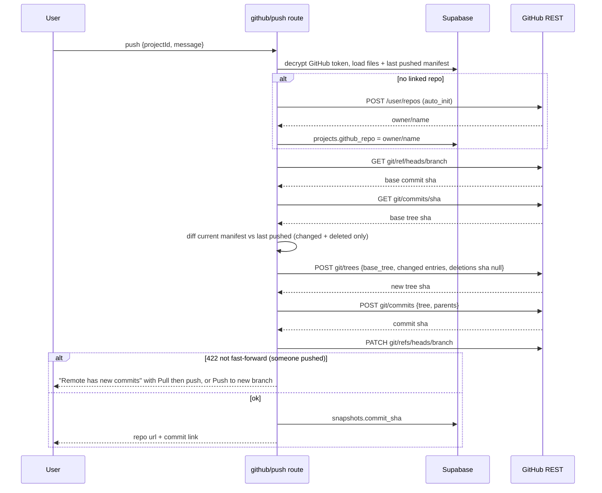

**Import:**

1. `GET /repos/{o}/{r}/git/trees/{branch}?recursive=1`.
2. Filter: skip `node_modules`, `.git`, `dist`, `build`, lockfiles (regenerated), binaries over 1 MB. Limits: 500 files and 5 MB of text in total.
3. Fetch blobs in parallel (concurrency 8), decode base64, write to `project_files`.
4. Detect the framework from `package.json`, then run `reverse-plan.ts` to create the plan.

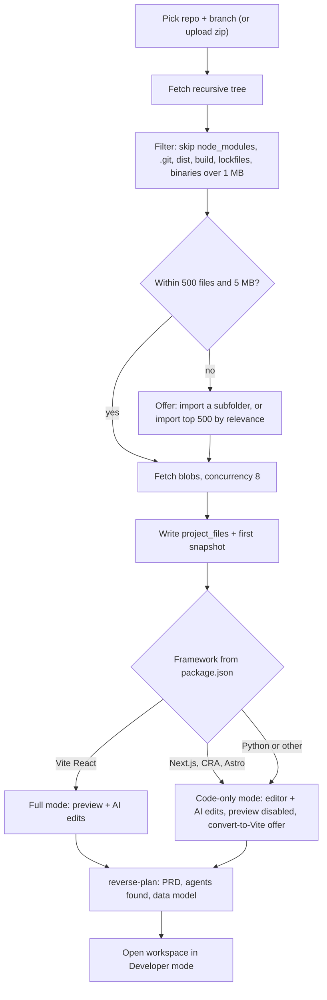

### 12.2 Vercel deploy

One Architect-owned Vercel token (`VERCEL_TOKEN`, optionally `VERCEL_TEAM_ID`). Each Architect project maps to a Vercel project named `arch-{slug}`.

1. Collect current files, excluding dev-only files (the `data-arch-src` plugin and error bridge are dev-only). Env vars from `project_env` whose names start with `VITE_` are set on the Vercel project (`POST /v10/projects/{idOrName}/env`) before deploying, so Vite inlines them at build time. A static Vite deploy cannot hold server-side secrets, and the Env tab says so.
2. `POST https://api.vercel.com/v13/deployments?teamId=...`:

```json
{
  "name": "arch-travel-planner",
  "target": "production",
  "files": [
    { "file": "package.json", "data": "<base64>", "encoding": "base64" },
    { "file": "src/App.tsx", "data": "<base64>", "encoding": "base64" }
  ],
  "projectSettings": {
    "framework": "vite",
    "buildCommand": "npm run build",
    "outputDirectory": "dist",
    "installCommand": "npm install"
  }
}
```

3. For large projects: upload each file with `POST /v2/files` (headers `x-vercel-digest: <sha1>`, `Content-Length`), then send `{ file, sha, size }` entries instead of inline data.
4. Poll `GET /v13/deployments/{id}` every 3 seconds (client polls `/api/deploy/[id]/status`). Map `readyState`: `QUEUED`/`INITIALIZING` → queued, `BUILDING` → building, `READY` → ready, `ERROR`/`CANCELED` → error. On error, fetch build logs through `GET /v3/deployments/{id}/events` and show them with a "Fix with AI" button.
5. **Subdomain rename:** set a project alias to `{name}.vercel.app` (or a wildcard domain you own, such as `{name}.yourarchitect.app`). Check availability first.
6. The deployed app calls `POST /api/public/agents/run` with its project `public_key`, so agents keep working after deploy.

### 12.3 Dummy integrations

Gmail, Slack, Notion, HubSpot, Jira, Linear, Google Drive and others appear as connect cards in the Agents drawer and in Settings. Clicking **Connect** opens a mocked OAuth modal that sets `integrations.meta.mock = true`. Agents that use these tools get canned responses from `lib/ai/mock-tools.ts`.

### 12.4 Guest / demo mode

The submission checklist (section 16.3) requires reviewers to evaluate the product **without signing up**. `/try` provides this.

1. **Enter.** `/try` calls `supabase.auth.signInAnonymously()`, creating a real (but anonymous) `auth.users` row, so RLS and every real feature work unchanged. The `profiles` trigger runs as normal; `profiles.mode` defaults to `simple`.
2. **Seed.** On first entry the server clones one or two prebuilt demo projects from `lib/templates/demo/` into the guest's account (files, plan, agents, one snapshot each) so the home page and workspace are populated, not empty. Reviewers land on a ready-to-explore project rather than a blank prompt box.
3. **Signal.** A persistent banner reads "You're in demo mode — sign up to keep your work." Expensive real calls (codegen, deploy) still run but under a tighter per-guest token bucket (section 8.5) to cap abuse.
4. **Claim.** "Sign up to save" upgrades the anonymous user in place via `supabase.auth.linkIdentity({ provider })` (or email + password), so all guest projects carry over with no migration. This mirrors the identity-linking flow used for connecting GitHub later.
5. **Cleanup.** Anonymous accounts and their projects are pruned after 30 days by a scheduled job (dummy for the assignment; documented as a cron).

Guest sessions cannot connect real GitHub/Vercel (no provider token); those actions show the "sign up to connect" state instead of failing.

---

## 13. Security

| Risk | Control |
|---|---|
| Cross-tenant data access | RLS on every table; `is_member()` checks; service role used only inside route handlers, never shipped to the client |
| Leaked API keys | `GROQ_API_KEY`, `VERCEL_TOKEN`, `SUPABASE_SECRET_KEY` are server-only (no `NEXT_PUBLIC_` prefix). Add `import "server-only"` to `lib/ai`, `lib/github`, `lib/deploy` |
| Stored OAuth tokens and env values | Encrypted at rest with AES-256-GCM using `ENCRYPTION_KEY` (or Supabase Vault/pgsodium); decrypted only in route handlers |
| Running untrusted generated code | Code runs inside the WebContainer (browser sandbox, separate origin for the preview iframe), never on the Architect server |
| Prompt injection from imported repos or uploads | Imported content goes into the user message, never the system prompt; tools only write inside the project; paths are normalized and `..` / absolute paths are rejected; file count and size limits per call |
| Abuse and runaway cost | Per-user token bucket (Postgres counter over `usage_events`, or Upstash Redis `@upstash/ratelimit`); per-key limits on `/api/public/agents/run`; max 3 self-heal attempts; max output tokens per stage |
| Public agent endpoint | `public_key` per project, can be rotated; origin allowlist (deployment URL + preview); 30 requests/minute default |
| CSRF / session | Supabase SSR cookies (`@supabase/ssr`), `SameSite=Lax`; route handlers check the session on every call |
| Deploy of malicious content | Deploys go to per-project Vercel projects; an abuse report link in the footer of deployed apps (dummy) |

---

## 14. Environment variables

A single `.env` file at the repository root (the `Lyzr AI/` folder), plus the Vercel project env. There are no env files in subfolders; the Supabase CLI, tests and scripts read the root file.

| Variable | Scope | Purpose |
|---|---|---|
| `NEXT_PUBLIC_SUPABASE_URL` | public | Supabase project URL |
| `NEXT_PUBLIC_SUPABASE_PUBLISHABLE_KEY` | public | Supabase publishable key `sb_publishable_…` (RLS applies). Replaces the legacy `anon` key, which Supabase retires by the end of 2026 |
| `SUPABASE_SECRET_KEY` | server | Supabase secret key `sb_secret_…` for admin operations (blobs, usage aggregation). Bypasses RLS. Replaces the legacy `service_role` key |
| `GROQ_API_KEY` | server | All LLM calls |
| `GITHUB_CLIENT_ID` / `GITHUB_CLIENT_SECRET` | Supabase dashboard | GitHub OAuth provider (configured in Supabase Auth, not read by the app) |
| `GOOGLE_CLIENT_ID` / `GOOGLE_CLIENT_SECRET` | Supabase dashboard | Google OAuth provider |
| `VERCEL_TOKEN` | server | Deploy API |
| `VERCEL_TEAM_ID` | server | Optional, if deploying under a team |
| `ENCRYPTION_KEY` | server | 32-byte base64 key for token/env encryption |
| `NEXT_PUBLIC_APP_URL` | public | Base URL, used for OAuth redirects and the public agent API |
| `UPSTASH_REDIS_REST_URL` / `UPSTASH_REDIS_REST_TOKEN` | server | Optional rate limiting |
| SMTP host, port, user, password (for example Resend) | Supabase dashboard | Optional. Custom SMTP so magic-link emails reach any address (the built-in sender only reaches project team members) |
| `SUPABASE_ACCESS_TOKEN` | CI secret | Personal access token for `supabase db push` and type generation in GitHub Actions; not read by the app |

Commit a `.env.example` at the root with these names and no values; `.gitignore` excludes `.env*` except `.env.example`.

### 14.1 Hosting this app on Hugging Face Spaces

The product itself can run as a Docker Space. Generated apps still deploy through the Vercel API in section 9.

The Space repo is this repository. A push to `main` runs `.github/workflows/huggingface.yml`, which uploads the tree to `Sankhua/project-ai` with a Hugging Face write token stored as the GitHub secret `HF_TOKEN`. The Space then rebuilds the Docker image. [Dockerfile](Dockerfile) builds `phase 5 - ship` with `output: "standalone"` and listens on `0.0.0.0:7860`. The root [README.md](README.md) starts with `sdk: docker` and `app_port: 7860`, which is what Spaces reads.

Do not copy `.env` into the image. In the Space settings, add secrets before you expect them to work:

| Secret | When it is read |
|---|---|
| `GROQ_API_KEY` | Runtime. Live plans and code generation. |
| `ENCRYPTION_KEY` | Runtime. GitHub tokens and saved project env values. |
| `VERCEL_TOKEN`, `VERCEL_TEAM_ID` | Runtime. Real deploys of generated apps. |
| `SUPABASE_SECRET_KEY` | Runtime. Admin operations. |
| `NEXT_PUBLIC_SUPABASE_URL`, `NEXT_PUBLIC_SUPABASE_PUBLISHABLE_KEY`, `NEXT_PUBLIC_APP_URL` | Image build. Next inlines `NEXT_PUBLIC_` values. Set them, then rebuild the Space. Leave them empty to keep the guest demo. |

`NEXT_PUBLIC_APP_URL` is the Space URL, `https://<user>-<space>.hf.space`. Without Supabase keys, **Try without an account** uses the local demo store inside the container. That store is created at runtime under `phase 5 - ship/.data` and is wiped when the Space restarts.

The Space page on huggingface.co embeds the app. Workspace routes still send cross-origin isolation headers, so the full WebContainer preview needs the direct `*.hf.space` URL. The embedded page uses the fallback preview.

---

## 15. Design system

The judges weight UI/UX most, so design is specified here instead of left to the implementer.

### 15.1 Direction

Calm, focused, "workbench" feel. Content first, chrome minimal. The AI's work is shown as clear, structured cards instead of long text walls. Do not copy the layout or styling of Architect, Lovable, v0 or Replit. The stage stepper, step cards and dual-lens toggle are our own patterns.

### 15.2 Tokens (`app/globals.css`, Tailwind v4 `@theme`)

```css
@theme {
  --font-sans: "Inter", ui-sans-serif, system-ui;
  --font-mono: "JetBrains Mono", ui-monospace;

  --color-bg: #FAFBFD;
  --color-surface: #FFFFFF;
  --color-surface-2: #F3F5F8;
  --color-border: #E3E6EC;
  --color-text: #1F2330;
  --color-text-muted: #6B7280;
  --color-accent: #4F46E5;      /* primary actions, active stage */
  --color-accent-soft: #EEF0FF;
  --color-success: #22A06B;
  --color-warning: #E5A50A;
  --color-danger: #D9443A;

  --radius-sm: 6px;             /* buttons, inputs */
  --radius-md: 10px;            /* cards, panels */
  --radius-lg: 14px;            /* modals */
  --shadow-card: 0 1px 2px rgb(0 0 0 / 0.04);
}
.dark {
  --color-bg: #0F1117;
  --color-surface: #161922;
  --color-surface-2: #1D212B;
  --color-border: #2A2F3A;
  --color-text: #E6E8EE;
  --color-text-muted: #9AA1AE;
  --color-accent: #818CF8;
  --color-accent-soft: #1E2140;
}
```

These values match the Stitch design system prompt (`stitch_prompt.md`, section 0), so the mockups in `stitch_design/` and the built app share one palette.

Spacing follows a 4px grid. Type scale: 12 / 13 / 14 (body) / 16 / 20 / 28 / 40.

### 15.3 Component rules

- **One primary action per screen.** Examples: "Approve plan", "Deploy". It sits in the same place (top-right of the canvas or the bottom approve bar).
- **Stage stepper** in the top bar always shows where the project is and what comes next. Completed stages can be clicked to revisit.
- **Step cards** in chat: icon + label + status (spinner, check, error) + expandable details (file list, logs).
- **File-op cards:** path, operation badge (created, updated, deleted), line delta; click to open the diff.
- **Empty states** give the next action (for example, the Agents tab before plan approval: "Agents are designed after you approve the plan" with a button).
- **Errors** are always actionable: "Fix with AI", "Show details", "Retry".
- **Loading states:** skeletons for lists, streaming for text, a progress bar for install/deploy.
- **Keyboard:** Cmd+K palette, Cmd+Enter send, Cmd+S save file, Cmd+B toggle chat, Cmd+Shift+D switch mode.
- **Accessibility:** WCAG AA contrast, focus rings, all actions reachable by keyboard, `aria-live` on streaming regions.

### 15.4 Theme presets for generated apps

Eight presets are stored as token JSON in `lib/templates/themes.ts`: Minimal, Editorial, Midnight, Soft Pastel, Corporate, Terminal, Warm Paper, Bold Neon. Each maps to CSS variables in the generated app's `src/theme.css` and is described in the codegen prompt.

---

## 16. Delivery plan

### 16.1 Phases

| Phase | Scope | Exit criteria |
|---|---|---|
| **P0 — Shell and auth** | Next.js app, Tailwind + shadcn, design tokens, Supabase project + migrations + RLS, login (magic link, Google, GitHub), app layout, home page, project create, workspace shell with empty tabs | Can sign in, create a project, see the workspace |
| **P1 — Chat, plan, codegen** | `lib/ai` models, prompts, tools; `/api/chat`, `/api/plan`, `/api/agents/design`, `/api/generate`; plan doc UI with approve; agent graph; file-op streaming; snapshots | Prompt → plan → agents → files saved in the database |
| **P2 — Preview and self-heal** | WebContainer runtime, COOP/COEP headers, terminal, error bridge, fix loop, Monaco editor, diff view, history + restore, Sandpack fallback | Generated app runs live; a broken import gets fixed automatically |
| **P3 — GitHub and deploy** | GitHub connect, push, import, branch list; Vercel deploy + status + logs; public agent API | Repo created with the code; live URL works and calls agents |
| **P4 — Coverage and polish** | AI Consultant, prompt library, templates, marketplace, integrations, sharing, usage page, env tab, dummy flows from the feature matrix, responsive layout, dark mode, empty/error states, landing page | Every row in section 5 is reachable; walkthrough recorded |

Suggested timeline for a take-home: P0 half a day, P1 one day, P2 one day, P3 half a day, P4 one day.

### 16.1a Time-constrained fallback ordering

Judging weights **design/UX/flows (#1)** and **feature coverage (#2)** far above **working functionality (plus points)**. So if time runs short, protect breadth and polish by demoting "Real" features to convincing dummy flows in this order (first to go listed first):

1. **Vercel deploy → dummy.** Show the deploy wizard, a fake Queued→Building→Ready progression, and a plausible live URL. Cheapest to fake, lowest judging cost.
2. **GitHub push → dummy.** Keep the connect/repo/commit UI; mock the commit result.
3. **WebContainer codegen/preview → dummy.** Fall back to a prebuilt preview per demo project and scripted file-op cards. This is the last thing to fake, since a live preview is the single most impressive real feature.

Never demote below-the-line the flows themselves (plan → agents → build → ship), the dual-mode toggle, guest mode, or the design system — those *are* the assignment.

### 16.2 Working with Cursor and Claude Code

- **`CLAUDE.md`** at the repo root (read by Claude Code) and **`.cursor/rules/*.mdc`** (read by Cursor) share the same content:
  - Link to this file as the source of truth; each task should cite the section it implements.
  - Stack and library choices (section 7), folder layout, naming (`PascalCase` components, `kebab-case` routes).
  - Rules: server-only secrets, zod on every route, RLS on every new table, no new dependencies without updating section 7.
  - Commands: `pnpm dev`, `pnpm lint`, `pnpm typecheck`, `supabase db push`, `supabase gen types typescript`.
- **Split of work:**
  - Claude Code (terminal agent): scaffolding, migrations, route handlers, integration code (GitHub, Vercel), scripted checks.
  - Cursor (editor agent): UI components, workspace layout, design polish, and iterating visually against the running app.
- **Task size:** one phase row or one feature-matrix row per session. Commit after each with a message that names the section, for example `feat(p2): webcontainer runtime (§9.1)`.
- **Verification per task:** `pnpm typecheck && pnpm lint`, plus a short manual check in the browser listed in the task.

### 16.3 Submission checklist

- [ ] Live URL on Vercel with sign-in working
- [ ] Public GitHub repo with README (screenshots, feature matrix, architecture link, setup steps)
- [ ] Demo account or guest mode so reviewers can enter without signing up
- [ ] 2–3 minute walkthrough video (optional but useful)
- [ ] Submitted in the Submit tab on [hiring.lyzrarchitect.space](https://hiring.lyzrarchitect.space)

---

## 17. Risks and fallbacks

| Risk | Impact | Mitigation |
|---|---|---|
| WebContainers need cross-origin isolation and a modern browser; limited on Safari/mobile | Preview does not boot | Sandpack fallback (section 9.5); banner; deployed preview link as last resort |
| COOP/COEP breaks third-party embeds on workspace routes | Broken avatars, fonts, OAuth popups | Headers scoped to `/p/*`; self-host fonts; proxy avatars; OAuth uses redirects, not popups |
| Native npm modules (`sharp`, `bcrypt`, `sqlite3`) fail in WebContainers | Install errors | Allowed-dependency list in the codegen prompt; fix prompt suggests pure-JS alternatives (`bcryptjs`) |
| Groq rate limits (free tier: 8K tokens/min and 200K tokens/day per model, shared by all users; the Developer plan is much higher) | Slow or failed builds; free tier cannot fit a code-generation request | Developer (pay-as-you-go) plan before P1; token bucket, backoff with `retry-after`, smaller context via file selection, `gpt-oss-20b` for cheap stages; prebuilt demo projects so exploring costs no tokens |
| Groq model retirement | Calls fail | Model IDs in one config file; startup check against `/openai/v1/models` |
| Open-weight models produce invalid JSON or broken code | Failed builds | zod validation + one re-prompt; whole-file updates; self-heal loop; allowed dependency list |
| Vercel function timeouts on long generations | Stream cut off | `maxDuration = 300` on AI routes; split first build into batches (layout → pages → components) |
| Vercel build failures on deploy | No live URL | Show build logs; "Fix with AI" feeds logs to the fix prompt; run `vite build` inside the WebContainer before deploying |
| Large repos on import | Slow or out-of-memory | 500 files / 5 MB limit; skip generated folders; code-only mode for unsupported frameworks |
| GitHub provider token not refreshed by Supabase | Push fails after token expiry | Detect `401`, prompt reconnect; optional GitHub App later |
| Scope too large for a take-home | Unfinished demo | Phased plan; dummy flows are acceptable per the assignment; polish P0–P3 paths first |

---

## 18. Component inventory and UI states

Every component below is real (built), and each ships the four canonical states where applicable: **empty · loading · error · success**. Grouped by surface.

### 18.1 Shell and navigation

| Component | Props (key) | States | Notes |
|---|---|---|---|
| `AppSidebar` | `mode`, `activeRoute` | collapsed / expanded | Home, Templates, Marketplace, Import, Usage, Settings; mode toggle at bottom |
| `CommandPalette` (`cmdk`) | `commands[]` | idle / searching / empty | Cmd+K; actions grouped: Navigate, Project, Create, Account |
| `TopBar` | `project`, `stage`, `mode` | — | Project name (inline rename), `StageStepper`, mode switch, Share, Deploy |
| `StageStepper` | `stage`, `onJump` | plan/agents/build/ship | Completed stages clickable; current pulses |
| `StatusBar` | `runtime`, `snapshotId`, `credits` | booting/installing/ready/error | Bottom of workspace |
| `Toaster` | — | info/success/warning/error | `sonner`; deploy/push results, token limits |
| `GuestBanner` | `onClaim` | shown when `user.is_anonymous` | "Sign up to keep your work" |

### 18.2 Home and onboarding

`PromptBox` (auto-grow textarea, `Cmd+Enter` send, voice button), `PlusMenu` (attach files, theme, add agents, prompt library), `TemplateStrip`, `PromptLibrary` (filter by role/task), `RecentProjects` grid (card: thumbnail, name, stage badge, last-edited), `ConsultantWizard` (3 steps, progress dots), `IdeaCard` (title, hours-saved pill, "Use this" CTA).

### 18.3 Workspace

`ChatPanel` → `MessageList` → (`UserMessage`, `AssistantMessage`, `StepCard`, `FileOpCard`, `ErrorCard`, `PlanSectionCard`, `AgentCard`), `Composer` (attach, theme, **Plan/Build** toggle, **Test** toggle, voice, send). Canvas tabs: `PreviewFrame` + `DeviceToolbar` + `ConsoleDrawer` + `ElementPicker`; `PlanDoc` + `ApproveBar`; `AgentGraph` (React Flow) + `AgentDrawer` + `AgentTestConsole` + `FrameworkPicker`; `FileTree` + `Editor` (Monaco) + `DiffView`; `Terminal` (xterm); `CollectionList` + `DocumentTable`; `EnvTable`; `GitPanel` + `BranchSelect` + `CommitList`.

### 18.4 Deploy, history, settings

`DeployWizard` (target → subdomain → confirm), `DeployStatus` (Queued→Building→Ready with logs), `DomainForm`, `SnapshotTimeline` + `RestoreDialog`, `ShareModal` (invite, roles), `UsageCharts` (by project/stage/agent), `ThemePicker` (8 presets + BYO), `DangerZone` (delete project, rotate public key).

### 18.5 Canonical state matrix

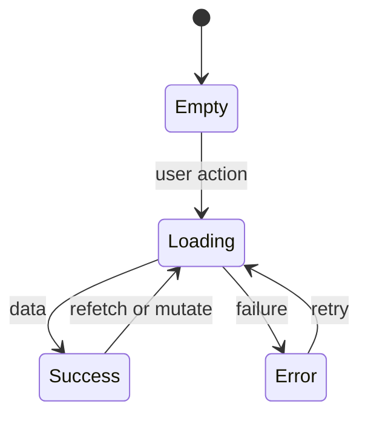

Rules: empty states name the next action; loading uses skeletons (lists) or streaming (text); errors always offer Retry / Fix with AI / Show details; success is the resting state.

---

## 19. Client state, stores and the streaming contract

### 19.1 Zustand stores

```ts
// stores/ui.ts
interface UiState {
  mode: "simple" | "developer";
  activeTab: WorkspaceTab;
  panelSizes: number[];          // react-resizable-panels
  paletteOpen: boolean;
  setMode(m): void; setTab(t): void;
}
// stores/chat.ts
interface ChatState {
  messages: UiMessage[];
  streaming: boolean;
  pendingIntent?: Intent;
}
// stores/project.ts
interface ProjectState {
  files: Record<string, FileNode>;   // path -> {content, sha, dirty}
  activeFile?: string;
  snapshots: Snapshot[];
  plan?: PlanDoc; agents: AgentSpec[];
}
// stores/runtime.ts  (single owner of the WebContainer)
interface RuntimeState {
  status: "idle"|"booting"|"mounting"|"installing"|"starting"|"ready"|"error";
  previewUrl?: string;
  errors: PreviewError[];
  container?: WebContainer;          // never serialized
}
```

Server state (projects, messages, snapshots, deployments, usage) is owned by **TanStack Query**, not the stores. Stores hold only client/session-derived state. This split prevents the classic "two sources of truth" bug.

### 19.2 Query keys

```ts
["projects"] | ["project", id] | ["files", id] | ["messages", id]
| ["snapshots", id] | ["deployment", depId] | ["usage", {from,to}]
| ["github","repos"] | ["github","branches", id]
```

Mutations invalidate the narrowest key; realtime pushes (section 20) call `queryClient.setQueryData` to patch without a refetch.

### 19.3 Streaming data-part contract (Vercel AI SDK)

All AI routes emit a typed UI message stream. The client `useChat` maps each `data-*` part to a component:

| Data part | Payload | Renders as |
|---|---|---|
| `data-intent` | `{ intent, confidence }` | routes the message; usually invisible |
| `data-plan-section` | `{ key, title, body }` | `PlanSectionCard`, appended to `PlanDoc` |
| `data-agent` | `AgentSpec` | node added to `AgentGraph` |
| `data-step` | `{ label, status, detail? }` | `StepCard` (spinner→check/error) |
| `data-file-op` | `{ op, path, lineDelta }` | `FileOpCard`; also applied to WebContainer |
| `data-usage` | `{ stage, inputTokens, outputTokens }` | increments credits in `StatusBar` |
| `data-snapshot` | `{ snapshotId }` | marks the build as saved |

The order guarantee: `data-step("Writing files")` → N × `data-file-op` → `data-snapshot` → assistant text. The client never parses free-form markdown for file changes.

---

## 20. Realtime and collaboration

Supabase Realtime channel `project:{id}` carries three message types.

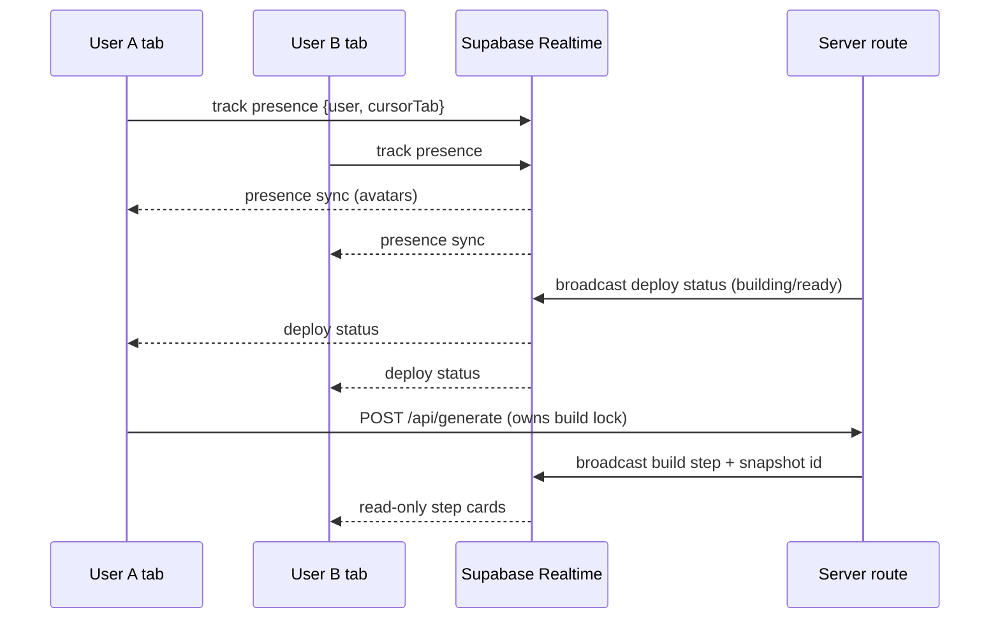

| Concern | Approach |
|---|---|
| Presence | `channel.track({ userId, name, avatar, tab })`; avatars in `TopBar` |
| Build lock | One editor drives a build at a time; a Postgres advisory lock (`pg_try_advisory_lock(projectId)`) prevents concurrent codegen. Others see a "build in progress" read-only state |
| File edits (manual) | Last-write-wins on `project_files` by `updated_at`; a conflict toast offers "reload latest". Full CRDT is out of scope (documented) |
| Deploy/status fan-out | Server broadcasts `deployments` row changes so every viewer sees the same progress |

For the assignment, presence + deploy fan-out are **Real**; multi-user simultaneous editing is **Partial** (last-write-wins, no OT/CRDT).

---

## 21. Observability, logging and analytics

```mermaid
flowchart LR
  routes[API routes] -->|structured logs| logs[Vercel logs / console]
  routes -->|usage_events| db[(Supabase)]
  client[Browser] -->|product events| analytics[analytics table + PostHog optional]
  db --> usagePage[/usage dashboard/]
  analytics --> funnels[Funnel views optional]
```

- **Request logging.** Each route logs `{ requestId, userId, projectId, route, stage, model, ms, inputTokens, outputTokens, status }` as one JSON line. `requestId` (nanoid) is returned in a response header and shown in error cards, so a reviewer can correlate a failure with a log line.
- **AI telemetry.** Every Groq call writes a `usage_events` row (section 10.2). The `/usage` page aggregates by project, stage and agent, and estimates cost with a constant price map (`lib/billing/prices.ts`).
- **Product analytics (optional).** Key funnel events — `signup`, `guest_start`, `project_created`, `plan_approved`, `build_succeeded`, `preview_ready`, `github_pushed`, `deployed` — logged to an `analytics` table (or PostHog if `NEXT_PUBLIC_POSTHOG_KEY` is set). Drives an activation funnel view.
- **Error tracking.** Client errors and unhandled route errors report to Sentry when `SENTRY_DSN` is set; otherwise console + toast. WebContainer preview errors are captured by the error bridge (section 9.3), not Sentry (they are the user's generated code, not ours).

---

## 22. Testing and AI evaluation strategy

```mermaid
flowchart TD
  unit[Unit: Vitest] --> integ[Integration: route handlers + Supabase local]
  integ --> e2e[E2E: Playwright]
  e2e --> aieval[AI eval: golden prompts]
```

| Layer | Tool | Scope | Example |
|---|---|---|---|
| Unit | Vitest | pure logic | `applyOps` file merge, `context.ts` selection, sha hashing, zip filters |
| Component | Vitest + Testing Library | UI states | `StepCard` spinner→check; `EnvTable` add/remove |
| Integration | Vitest + Supabase local (Docker) | routes + RLS | `POST /api/generate` writes files + snapshot; RLS blocks non-members |
| E2E | Playwright (this repo's `playwright` skill) | full flows | guest → prompt → plan approve → build → preview ready → deploy (mock) |
| AI eval | Golden-set harness | prompt quality | 10 fixed prompts assert: plan has all sections, codegen produces buildable Vite app, fix loop clears a seeded error |

- **AI evals** run against recorded fixtures by default (deterministic, no cost); a `--live` flag hits Groq for a weekly check. Assertions are structural (valid JSON tool calls, files compile) not exact-match, because open-weight output varies.
- **CI gate:** `pnpm typecheck && pnpm lint && pnpm test` on every push; Playwright smoke on PRs. See section 25.

---

## 23. Performance, caching and scalability

### 23.1 Budgets

| Metric | Target |
|---|---|
| Landing LCP | < 1.5s |
| Workspace TTI | < 2.5s |
| First plan token | < 1.5s after submit |
| Preview ready (first build) | < 20s (install-bound) |
| Chat iteration → HMR | < 2s |

### 23.2 Techniques

- **Caching.** `npm install` skipped when the `package.json` hash is unchanged (section 9.1). TanStack Query caches server state with `staleTime` tuned per key (files: 0, templates: 1h). Static assets and templates served from the edge.
- **Prompt caching.** Reused system prompts (template conventions, theme tokens) are placed first so Groq's prefix cache can hit them; `cached_tokens` logged to `usage_events`.
- **Streaming everywhere** so time-to-first-byte, not total latency, is what the user feels.
- **Context trimming** (section 8.4) caps tokens and keeps codegen inside `maxDuration`.
- **Code-splitting.** Monaco, xterm and React Flow are dynamically imported only in Developer mode / their tabs, keeping the Simple-mode bundle small.
- **DB.** Indexes on `usage_events(user_id, created_at)`, `project_files(project_id, path)` (PK), `messages(project_id, created_at)`. `file_blobs` is content-addressed to dedupe snapshot storage.

### 23.3 Scale trade-offs (documented, not all built)

Preview runs client-side (no server fan-out cost). The server is stateless except for Postgres; horizontal scale is automatic on Vercel. The single bottleneck is the shared Groq token bucket — mitigated by per-user limits and model tiering (`gpt-oss-20b` for cheap stages).

---

## 24. Accessibility, internationalization and responsive design

- **A11y (WCAG AA).** All interactive elements keyboard-reachable; visible focus rings; `aria-live="polite"` on streaming chat and status regions; dialogs trap focus and restore it; color is never the only signal (icons + text on status). Contrast verified against the section 15 tokens in both themes.
- **Keyboard map.** Cmd+K palette · Cmd+Enter send · Cmd+S save file · Cmd+B toggle chat · Cmd+Shift+D switch mode · `[`/`]` prev/next tab · Esc close drawer. A "?" shortcut opens a shortcuts sheet.
- **Responsive.** Three breakpoints: **≥1280** full three-pane workspace; **768–1279** collapsible file tree, chat as overlay; **<768** chat and canvas become two tabs, deploy/preview links open full-screen. Marketing and auth are mobile-first.
- **i18n scaffold.** All copy in `lib/i18n/en.ts`; components read via a `t()` helper. Only English ships, but the structure shows the intent and avoids hard-coded strings. Numbers/dates via `Intl`.
- **Reduced motion.** `prefers-reduced-motion` disables the stepper pulse and card transitions.

---

## 25. CI/CD, environments and operations

```mermaid
flowchart LR
  dev[Local: pnpm dev + supabase start] --> pr[PR: typecheck, lint, test, playwright smoke]
  pr --> preview[Vercel preview deploy + Supabase branch]
  preview --> main[main: prod deploy + supabase db push]
```

| Environment | Frontend | Database | Secrets |
|---|---|---|---|
| Local | `pnpm dev` | `supabase start` (Docker) | Root `.env` |
| Preview (per PR) | Vercel Preview | Supabase preview branch | Vercel env (Preview scope) |
| Production | Vercel Production | Supabase prod project | Vercel env (Production scope) |

- **Migrations.** SQL migrations in `supabase/migrations/` applied with `supabase db push`; types regenerated via `supabase gen types typescript` and committed. No manual dashboard schema edits.
- **Pipeline.** GitHub Actions: install (pnpm cache) → typecheck → lint → unit/integration → Playwright smoke → (on main) `db push` + Vercel deploy. Fails closed.
- **Rollback.** Vercel instant rollback to the previous deployment; DB migrations are forward-only with a documented down-path per migration.
- **Runbook (short).** Groq 429s → check `usage_events` spike, raise per-user bucket temporarily. Preview won't boot → verify COOP/COEP on `/p/*` and fall back to Sandpack. Deploy stuck in Building → read Vercel events, offer "Fix with AI".
- **Config drift guard.** A startup check validates required env vars and the configured Groq model IDs against `GET /openai/v1/models`, logging a warning on mismatch (section 8.1).

---

## 26. Competitive research and feature derivation

The assignment asks us to study the reference platforms and then design from first principles. This table records what each platform does well and the **principle** we take from it. We borrow principles, not layouts.

| Platform | Known for | Principle we take | Where it shows up in Architect 2.0 |
|---|---|---|---|
| **architect.new** (current) | Prompt → PRD → agents → app; AI Consultant; Studio agents; managed backend; GitAgent | Plan before build; agents are first-class, not an afterthought | Stage stepper, plan approval, agent graph |
| **Replit** | Cloud IDE + AI agent, built-in database, one-click deploy | Code, runtime and deploy in one place | Developer mode: editor, terminal, deploy in the same workspace |
| **Lovable** | Chat to a React app, visual edits, GitHub sync, Supabase backend | Non-technical users should be able to point at the UI and change it | Element picker, auto-commit to GitHub |
| **Emergent** | Multi-agent app building for full-stack apps | Show the work of several specialised agents | Step cards per stage, agent trace timeline |
| **Vercel v0** | High-quality UI generation on shadcn/Tailwind, deploy on Vercel | Design quality depends on a strong component base and tokens | Theme presets, token-driven generated apps |
| **Rocket.new** | Prompt or design import to app | Start from what the user already has | Import repo/zip, bring-your-own design system (dummy) |
| **Cursor** | AI inside the editor, codebase context, project rules | Context quality decides output quality | Context builder (section 8.4), project rules file |
| **Codex** | Cloud agent that works on tasks and proposes changes | Changes should be reviewable before they land | Diff view per snapshot, Plan Mode before build |
| **Claude Code** | Terminal agent, `CLAUDE.md` project memory, MCP tools | Power users want scriptable, tool-extensible agents | CLI/API page (dummy), MCP connections (dummy), GitAgent files |

### 26.1 Gaps we target

| Gap in today's Architect | Architect 2.0 answer |
|---|---|
| No code view for developers | Developer mode with editor, terminal, diffs |
| Hard to start from existing code | Import repo/zip with reverse PRD |
| Agents tied to one framework | Framework picker (Lyzr, LangGraph, CrewAI, OpenAI Agents SDK, GitAgent) |
| Little visibility into why a build failed | Error bridge, self-heal steps, "Restore last good version" |
| Cost is opaque | Per-stage and per-agent token usage |

---

## 27. Feature specifications: required surfaces

The assignment lists eight surfaces. Each gets a short spec: goal, layout, key interactions, states and status.

### 27.1 Authentication

- **Goal:** get in within 10 seconds, or try without an account.
- **Layout:** split screen. Left: product value in one line plus a short looping preview. Right: "Continue with Google", "Continue with GitHub", email magic link, and "Try without an account".
- **Interactions:** magic-link sent state with "Open mail app" and resend timer (30s); GitHub sign-in requests repo scope only when needed (linked later from the Git tab).
- **States:** idle, sending, link sent, error (invalid email, provider cancelled), signed in.
- **Tech:** Supabase Auth, `@supabase/ssr`, anonymous sign-in for `/try`, `linkIdentity` to upgrade guests.
- **Status:** Real.

### 27.2 Homepage

- **Goal:** turn intent into a project with the least friction.
- **Layout:**

```
+--------------------------------------------------------------+
| Sidebar | "What do you want to build?"                        |
|         | [ Prompt box ....................... (+) (mic) (Go) ]|
|         |  chips: Simple | Developer  ·  Theme: Minimal         |
|         |  Suggestions from AI Consultant (3 cards)            |
|         |  Templates strip  ·  Prompt library                  |
|         |  Recent projects grid (thumbnail, stage badge)       |
+--------------------------------------------------------------+
```

- **Interactions:** `Cmd+Enter` to create; `+` menu for files, theme, existing agents, prompt library; voice input via Whisper; "Import from GitHub" as a secondary action.
- **States:** first run (consultant suggestions), returning (recent projects), empty search, upload progress.
- **Status:** Real (Studio agent picker is Dummy).

### 27.3 Chat window

- **Goal:** one conversation that drives every stage, with visible progress.
- **Message types:** user message, assistant text, `StepCard`, `FileOpCard`, `PlanSectionCard`, `AgentCard`, `ErrorCard`, `DeployCard`.
- **Composer:** attach, theme, **Plan/Build** toggle, **Test** toggle, voice, send, stop generating. Slash commands: `/plan`, `/fix`, `/agent`, `/deploy`, `/restore`.
- **Interactions:** click a file card to open its diff; click a step to expand logs; "Retry from here" on any assistant message (restores the snapshot before it, then re-runs).
- **States:** idle, streaming (stop button), waiting for approval, rate-limited (countdown), error.
- **Status:** Real.

### 27.4 App preview

- **Goal:** see the app running and change it by pointing at it.
- **Toolbar:** device sizes (desktop, tablet, mobile), refresh, open in new tab, element picker, console drawer toggle, "Open deployed version" when deployed.
- **Console drawer:** runtime logs and errors with "Fix with AI" per error.
- **States:** booting, installing (progress with log lines), starting, ready, error (with fix actions), fallback (Sandpack banner).
- **Status:** Real.

### 27.5 Agent section

- **Goal:** understand and shape the AI behind the app without reading code.
- **Layout:** graph canvas (manager at top, sub-agents below, tools and knowledge as small chips). Clicking a node opens a drawer with tabs: Overview, Instructions, Tools, Knowledge, Framework, Test, Runs.
- **Interactions:** edit instructions inline (saved as a new agent version); add/remove tools from a catalog; switch framework (regenerates scaffold files); run a test with a trace timeline; "Open in Lyzr Studio" (Dummy).
- **States:** before plan approval (empty with explanation), designing (nodes stream in), ready, test running, test failed.
- **Status:** Real design and storage; Partial runtime (section 8.6).

### 27.6 UI getting built

- **Goal:** make the build feel alive and understandable.
- **Behaviour:** the build is split into visible batches: "Layout and theme" → "Pages" → "Components" → "Wiring agents" → "Checking". Each batch is a step card with its file list. The preview shows a skeleton of the page structure from the plan while files arrive, then swaps to the live app once the dev server is ready.
- **Developer mode:** the file tree highlights files as they are written, and the editor can follow the file being written.
- **Status:** Real.

### 27.7 GitHub integration

- **Goal:** own the code with one click, and keep it in sync.
- **Git tab:** connection status, repo link, branch selector, auto-commit toggle, commit list (message, snapshot, time), Push and Pull buttons, "Export to my GitHub" for guests after signup.
- **States:** not connected, connecting, connected without repo, synced, ahead (unpushed changes), conflict (remote has new commits), token expired (reconnect).
- **Status:** Real (branch switching Partial).

### 27.8 Deploying the app

- **Goal:** a live URL in under a minute, with clear progress and recovery.
- **Wizard:** Step 1 subdomain (availability check), Step 2 options (analytics, marketplace listing, custom domain — Dummy), Step 3 confirm. Pre-flight check runs `vite build` in the WebContainer to catch build errors before sending to Vercel.
- **Status view:** Queued → Building → Ready with live logs; on Ready: URL, copy, QR code, share links; on Error: logs plus "Fix with AI".
- **Deployments list:** history with status, snapshot, URL, "Redeploy" and "Promote" actions.
- **Status:** Real (custom domain, analytics, marketplace Dummy).

### 27.9 Additional surfaces

| Surface | Purpose | Status |
|---|---|---|
| AI Consultant onboarding | Suggest high-value apps from role, time sinks and tools | Real |
| Templates | Start from a working app | Real |
| Marketplace | Browse and clone community apps | Dummy (clone Real) |
| History | Timeline, diff, restore | Real |
| Usage | Tokens and estimated cost by project, stage, agent | Partial |
| Settings | Profile, mode, connected accounts, BYOK keys | Real |
| Sharing | Invite with roles, presence avatars | Partial (presence Real, invites Dummy) |
| Integrations catalog | Gmail, Slack, Notion, HubSpot, Jira, MCP servers | Dummy |
| CLI / API page | Tokens and example commands | Dummy |

---

## 28. Generated app architecture

What Architect produces for a user, and how it behaves in preview and after deploy.

```mermaid
flowchart TB
  subgraph genApp [Generated Vite React app]
    router["App.tsx router"] --> pagesNode["src/pages/*"]
    pagesNode --> comps["src/components/*"]
    comps --> themeCss["src/theme.css tokens"]
    comps --> agentsClient["src/lib/agents.ts"]
    comps --> dbClient["src/lib/db.ts"]
  end
  subgraph previewEnv [In preview]
    wcRun["WebContainer vite dev"]
  end
  subgraph prodEnv [After deploy]
    vercelStatic["Vercel static build"]
  end
  agentsClient -->|"x-architect-key + agentName + input"| publicApi["Architect public agent API"]
  publicApi --> groqRun["Groq via agent runtime"]
  dbClient -->|"v1"| local["localStorage collections"]
  dbClient -.->|"future"| supaGen["Per-app Supabase schema"]
  genApp --> wcRun
  genApp --> vercelStatic
```

| Part | Contract |
|---|---|
| `src/lib/agents.ts` | `runAgent(name, input, onToken?)` streams from `/api/public/agents/run`. The base URL and project key are injected as `VITE_ARCHITECT_URL` and `VITE_ARCHITECT_KEY` |
| `src/lib/db.ts` | `collection(name).list/get/insert/update/remove` over localStorage, with the same API a future Supabase adapter would implement. The Database tab reads these through the preview bridge |
| Auth in generated apps | Mock sign-in screen stored in localStorage (Dummy); the plan marks where real auth would plug in |
| Theme | `theme.css` CSS variables from the chosen preset; Tailwind reads them through `@theme` |
| Agent folder | `agents/<name>/` holds framework scaffolds (for example `graph.py` for LangGraph, `crew.py` for CrewAI, `SOUL.md` + `agent.yaml` for GitAgent). They are exported to GitHub but not run in preview |

---

## 29. Knowledge pipeline (attachments)

Groq is used for generation, but a production embedding model is not part of this plan. Version 1 therefore uses **Postgres full-text search**, which is real, fast enough for small knowledge sets, and needs no extra provider. The table shape leaves room for `pgvector` later.

```mermaid
flowchart LR
  upload["Upload PDF, DOCX, TXT, MD, CSV"] --> store["Supabase Storage uploads/projectId/"]
  store --> extract["Extract text: unpdf, mammoth, papaparse"]
  extract --> chunk["Chunk: about 800 tokens, 100 overlap, keep headings"]
  chunk --> index["knowledge_chunks with tsvector (GIN index)"]
  query["Agent input or codegen need"] --> search["websearch_to_tsquery + ts_rank, top 5"]
  index --> search
  search --> prompt["Added to agent prompt with source labels"]
  extract -->|"CSV only"| schema["Column summary for data-analyst agents"]
```

```sql
create table knowledge_chunks (
  id bigserial primary key,
  project_id uuid not null references projects on delete cascade,
  file_path text not null,                 -- storage path
  agent_name text,                         -- null = shared by all agents
  chunk_index int not null,
  content text not null,
  tsv tsvector generated always as (to_tsvector('english', content)) stored
  -- embedding vector(768)                 -- reserved for pgvector
);
create index on knowledge_chunks using gin (tsv);
alter table knowledge_chunks enable row level security;
create policy "members read chunks" on knowledge_chunks for select using (is_member(project_id));
```

Limits: 10 files per project, 10 MB each, 2,000 chunks per project. Extraction runs in a route handler right after upload, and the file card shows "Indexing" then "Ready (n chunks)".

---

## 30. Feature map

```mermaid
mindmap
  root((Architect 2.0))
    Start
      Auth and guest mode
      AI Consultant
      Prompt box and voice
      Templates and prompt library
      Import repo or zip
    Plan
      PRD generation
      Inline edit and refine
      Plan Mode for changes
      Reverse PRD on import
    Agents
      Agent graph
      Instructions tools knowledge
      Framework picker
      Test console and traces
      GitAgent files
    Build
      Streaming code generation
      Live preview
      Self heal loop
      Element picker
      Code editor terminal diffs
      Env variables
      Database viewer
    Ship
      GitHub push and auto commit
      Vercel deploy
      Subdomain rename
      Deploy history and redeploy
    Operate
      Version history and restore
      Usage and cost
      Sharing and presence
      Integrations catalog
      Settings and BYOK
```

---

## 31. Architecture decision records (summary)

| # | Decision | Alternatives considered | Why |
|---|---|---|---|
| ADR-1 | Next.js App Router on Vercel | Remix, separate SPA + API | Streaming route handlers, one deploy target, same host as generated apps |
| ADR-2 | Supabase for auth, Postgres, storage, realtime | Firebase, Mongo + NextAuth | RLS for multi-tenant safety, SQL for usage analytics, anonymous auth for guests |
| ADR-3 | Groq with GPT-OSS models | OpenAI, Anthropic | Assignment preference; very fast tokens improve perceived build speed; OpenAI-compatible API |
| ADR-4 | Preview in WebContainers | E2B/Daytona cloud sandboxes, Vercel Sandbox | No per-user infra cost, instant hot reload; cloud sandbox listed as an upgrade path |
| ADR-5 | Generated apps use Vite + React | Next.js inside the container | Faster install and boot in the browser; static deploy |
| ADR-6 | Structured `writeFiles` tool with whole-file content | Unified diffs, markdown code blocks | Reliable parsing with open-weight models; easy snapshots |
| ADR-7 | Snapshots as content-addressed manifests | Full copies per version, git in the database | Cheap storage, instant restore, maps cleanly to GitHub trees |
| ADR-8 | GitHub via Git Data API, one commit per sync | Contents API per file | One atomic commit for many files; fewer API calls |
| ADR-9 | Vercel deploy API with inline or uploaded files | GitHub-triggered deploys only | Works without the user connecting GitHub |
| ADR-10 | Postgres full-text search for knowledge | pgvector with an external embedding API | No extra provider for v1; upgrade path kept |
| ADR-11 | Approval gates between stages | Fully autonomous build | Users catch wrong plans before spending tokens; matches the "product sense" judging |

---

## 32. References

**Assignment and current product**

- Assignment: [hiring.lyzrarchitect.space](https://hiring.lyzrarchitect.space) (local copy: [assignment.md](assignment.md))
- Current product: [architect.new](https://architect.new)
- Architect docs index: [docs.architect.new/llms.txt](https://docs.architect.new/llms.txt)
- Build guide: [docs.architect.new/build/build-guide](https://docs.architect.new/build/build-guide)
- How it works: [docs.architect.new/introduction/platform/how-it-works](https://docs.architect.new/introduction/platform/how-it-works)
- GitHub connect: [docs.architect.new/build/github-connect](https://docs.architect.new/build/github-connect)
- Database and auth: [docs.architect.new/build/database-auth](https://docs.architect.new/build/database-auth)
- Deployment: [docs.architect.new/build/deployment](https://docs.architect.new/build/deployment)
- GitAgent: [docs.architect.new/build/git-agents](https://docs.architect.new/build/git-agents)
- Release notes v2.2.0: [docs.architect.new/changelog/v2-2-0](https://docs.architect.new/changelog/v2-2-0)

**Groq**

- Supported models: [console.groq.com/docs/models](https://console.groq.com/docs/models)
- Built-in tools (Compound, GPT-OSS): [console.groq.com/docs/tool-use/built-in-tools](https://console.groq.com/docs/tool-use/built-in-tools)
- Changelog: [console.groq.com/docs/changelog](https://console.groq.com/docs/changelog)
- Vercel AI SDK Groq provider: [ai-sdk.dev/providers/ai-sdk-providers/groq](https://ai-sdk.dev/providers/ai-sdk-providers/groq)

**Preview runtime**

- WebContainers: [webcontainers.io](https://webcontainers.io/) and API guide [webcontainers.io/guides/quickstart](https://webcontainers.io/guides/quickstart)
- Cross-origin isolation: [web.dev/articles/coop-coep](https://web.dev/articles/coop-coep)
- Sandpack client: [sandpack.codesandbox.io/docs/advanced-usage/client](https://sandpack.codesandbox.io/docs/advanced-usage/client)
- Sandpack / Nodebox FAQ: [sandpack.codesandbox.io/docs/resources/faq](https://sandpack.codesandbox.io/docs/resources/faq)

**GitHub and Vercel**

- GitHub Git Data API (trees, commits, refs): [docs.github.com/en/rest/git](https://docs.github.com/en/rest/git)
- Create repo: [docs.github.com/en/rest/repos/repos#create-a-repository-for-the-authenticated-user](https://docs.github.com/en/rest/repos/repos#create-a-repository-for-the-authenticated-user)
- Vercel create deployment: [vercel.com/docs/rest-api/deployments/create-a-new-deployment](https://vercel.com/docs/rest-api/deployments/create-a-new-deployment)
- Vercel upload files: [vercel.com/docs/rest-api/sdk/deployments/upload-deployment-files](https://vercel.com/docs/rest-api/sdk/deployments/upload-deployment-files)

**Supabase and Next.js**

- Supabase Auth with Next.js (SSR): [supabase.com/docs/guides/auth/server-side/nextjs](https://supabase.com/docs/guides/auth/server-side/nextjs)
- Row Level Security: [supabase.com/docs/guides/database/postgres/row-level-security](https://supabase.com/docs/guides/database/postgres/row-level-security)
- Identity linking: [supabase.com/docs/guides/auth/auth-identity-linking](https://supabase.com/docs/guides/auth/auth-identity-linking)
- Next.js headers config: [nextjs.org/docs/app/api-reference/config/next-config-js/headers](https://nextjs.org/docs/app/api-reference/config/next-config-js/headers)

**Reference platforms to study (per the assignment)**

architect.new, Replit, Lovable, Emergent, Vercel v0, Rocket.new, Cursor, Codex, Claude Code.
